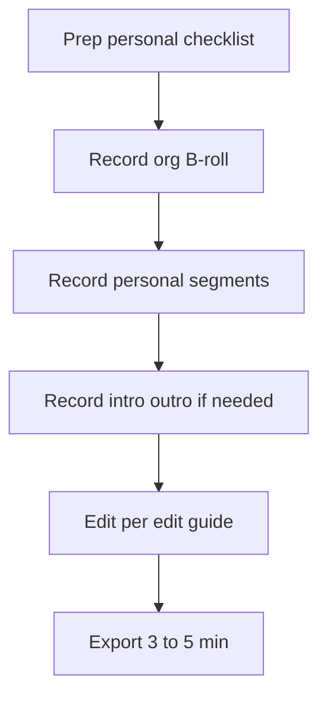

# Denoise demo video — production kit

~3–5 minute product demo focused on **GitHub connectivity** and dispatching
**init_stack** and **kickstart** from the denoise web app.

## Workspace strategy

| Workspace | Milestone | Role |
| --------- | --------- | ---- |
| **Org** | Non-GitHub | Short beat: planning without GitHub |
| **Org** | GitHub (initialized, ~half kickstarted) | B-roll and results only |
| **Personal** | Clean GitHub milestone | Live link, init_stack, kickstart |

The org GitHub milestone is too far along for live dispatches on camera. Use it
to show kickstart order, complexity badges, and PR links after the fact.

## Production documents

1. [prep-personal-checklist.md](./prep-personal-checklist.md) — Stage personal
   workspace and repo before recording.
2. [org-broll-shot-list.md](./org-broll-shot-list.md) — Shots to capture from
   the org milestone for cutaways.
3. [recording-script.md](./recording-script.md) — Narration, on-screen actions,
   and out-of-order recording sequence.
4. [recording-session-log.md](./recording-session-log.md) — Checklist to track
   segments as you record.
5. [edit-guide.md](./edit-guide.md) — Timeline, cuts during Actions waits, export
   checklist.

## Suggested workflow

## Related docs

- [GitHub integration](/denoise/github-integration/)
- [Milestone details](/denoise/milestone-details/)
- [Authentication](/denoise/authentication/)
