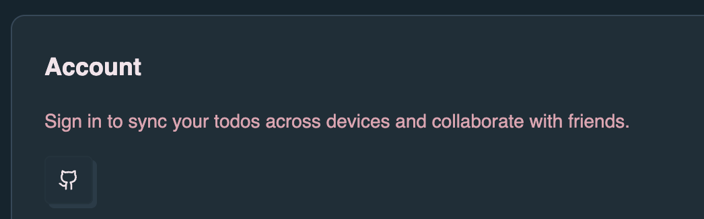
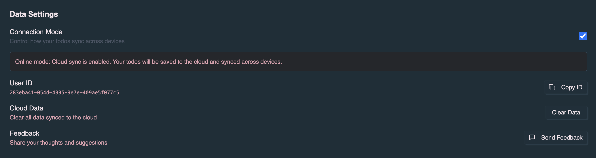

The app supports optional sign-in and an **Offline / Online** sync badge in the
header. You can use denoise without logging in; authentication determines what
syncs when you go online.

## Sign-in options

- **GitHub** — Sign in with your GitHub account. Required for
  [GitHub integration](/denoise/github-integration/) (linking milestones,
  syncing issues, converting tasks to issues, and dn workflow dispatch).
- **Google** — Sign in with your Google account. Gives you a stable identity and
  cloud sync; GitHub features still require GitHub auth.

Sign-in uses OAuth: click **Sign In**, choose GitHub or Google, complete the
flow in your browser, and you are redirected back to the app with a session.
Your session is stored in a cookie and validated by the server.

### GitHub App and repository access

GitHub sign-in uses a **GitHub App** (user-to-server). On first sign-in you may
see GitHub’s app installation or authorization screen, depending on how denoise
is deployed. You choose which repositories and organizations denoise can access.

After sign-in, manage access from **Profile**:

| Action                  | When to use                                                                                                |
| ----------------------- | ---------------------------------------------------------------------------------------------------------- |
| **Switch Accounts**     | Sign in with a different GitHub account (OAuth-only flow).                                                 |
| **Update repos & orgs** | Change which repositories and organizations denoise can use for milestones, issues, and workflow dispatch. |

You can also review installations at
[github.com/settings/installations](https://github.com/settings/installations).

Repository access must include any repo you link to a milestone. If linking or
sync fails with a permissions error, use **Update repos & orgs** and confirm the
target repository is granted access.

## Using the app without signing in

You can use denoise without signing in. In that case:

- All data stays **local** (IndexedDB). Tasks and milestones are stored only on
  your device.
- You can create and edit tasks, use milestones, and use the focus timer.
- GitHub integration (link milestone, create issue, sync with GitHub) is not
  available.

So “offline-first” applies either way: the app works locally first; sign-in and
the online sync badge add cloud sync and collaboration.

## Offline / Online sync badge

The header shows a sync badge with three possible states:

| State        | Meaning                                                                   |
| ------------ | ------------------------------------------------------------------------- |
| **Offline**  | No cloud sync. All data is stored only in IndexedDB on this device.       |
| **Syncing…** | You chose Online; the app is connecting to the server (or will time out). |
| **Online**   | Connected to the server. Todos for the current list sync to the cloud.    |

When you switch from Offline to Online, a confirmation asks: “Do you want to
sync your todos across devices?” If you confirm, the app tries to open a
WebSocket to the server. Whether it reaches **Online** depends on authentication
and what you have selected.

Connection mode can also be managed in **Profile** → **Data Settings**.

## How authentication and the sync badge interact

### When you are signed in (GitHub or Google)

- **Online** works fully:
  - **Milestone sync** — Your milestones (create, update, delete, share) sync to
    the server and are available on other devices and to collaborators.
  - **Todo sync** — Todos for the current milestone sync in real time. Data is
    stored in the cloud (Deno KV) and keyed by your user id or milestone id.
- **Offline** — Everything is local only; no server connection.

### When you are not signed in

- **Offline** — Same as above: everything is local.
- **Online** — Behavior is limited:
  - **Milestone sync is not available.** The server requires authentication for
    uploading or requesting milestones. So you cannot sync milestones across
    devices or use sharing when not signed in.
  - **Todo sync** can still work **only when a milestone is open.**\
    The app needs a “list id” to connect (either your user id or a milestone
    id). When you’re not signed in, there is no user id. If no milestone is
    open, there is no list id, so the WebSocket never connects and the badge
    will stay **Offline** (or show **Syncing…** then fall back to **Offline**
    after a few seconds).\
    If you **open a milestone** from the Roadmap, the list id is that
    milestone’s id. The server accepts the connection as an anonymous user and
    syncs todos for that list to the cloud. So you get real-time todo sync for
    that one list only, without a stable account or cross-device identity.

In short: **online without signing in** = todo sync for the currently open
milestone only; no milestone sync and no persistent identity across devices.

## Summary

| Signed in? | Badge   | Result                                                           |
| ---------- | ------- | ---------------------------------------------------------------- |
| No         | Offline | Local only; no server.                                           |
| No         | Online  | Todo sync only when a milestone is open; no milestone sync.      |
| Yes        | Offline | Local only; no server.                                           |
| Yes        | Online  | Full sync: milestones and todos, multi-device and collaboration. |

For full cloud sync, cross-device use, and GitHub integration, sign in (GitHub
for GitHub features, or Google for identity and sync) and switch to **Online**.
