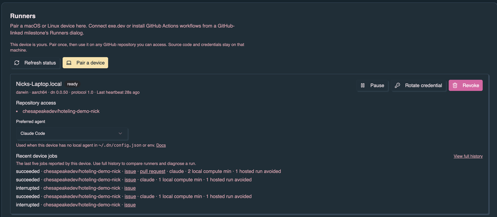
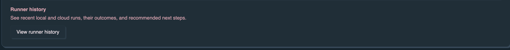

A device runner lets denoise send work to an existing macOS or Linux checkout.
Source, checkout paths, GitHub credentials, agent credentials, and compute stay
on that device.

Requires **dn 0.0.37** or newer on the device. See
[dn 0.0.37 and developer device runners](/whats-new/dn-0-0-37/) for current
guidance.

Device runners accept kickstart jobs, denoise-task jobs, and **task-sync** (Void
↔ `~/.dn/tasks/` relay). They do not run arbitrary commands or GitHub Actions
workflows.

## Local task sync (The Void)

Denoise does not store free-plan task bodies long-term. When
[The Void](/denoise/void/) creates or edits a ticketless task, denoise relays a
short-lived envelope to the paired runner. `dn runner serve` writes task
documents under `~/.dn/tasks/<id>.json` on the laptop.

This is **not** `dn todo` / `~/.dn/todo.md`. Todo remains the GitHub-issue and
plan-path kickstart queue. Local tasks are portable documents for ticketless
Void work and `denoise-task` kickstart.

```bash
dn task list
dn task show <id> --json
dn kickstart --denoise-task ~/.dn/tasks/<id>.json --publish none
```

Runner limits: **1** active device on Free, **10** on Denoise Pro (including
org-seat Pro). Pair from The Void **Devices** flow or denoise
**Profile** → **Runners**.

## Pair and prepare a device

The device needs `dn`, outbound HTTPS, a GitHub checkout (for repository
kickstart), and a supported agent harness. Run the service as your normal login
user.

1. In denoise, open **Profile** → **Runners** and click **Pair a device**. In
   The Void, open **Devices**. Either flow creates a pairing code.
2. Run:

   ```bash
   dn runner connect <code> --install --name "Alex's MacBook Pro"
   ```

3. Approve the pairing in the browser.
4. From every trusted checkout, register its remote:

   ```bash
   cd ~/src/project
   dn runner register
   ```

   Registration asks you to confirm trust. Use `--yes` only after inspecting the
   checkout.

5. Check readiness:

   ```bash
   dn runner doctor
   dn runner status
   ```

The UI distinguishes paired, online, and repository-ready devices. `--install`
creates `~/Library/LaunchAgents/cloud.denoise.runner.plist` on macOS or
`~/.config/systemd/user/denoise-runner.service` on Linux.



On the same panel, **View runner history** opens recent local and cloud runs,
their outcomes, and recommended next steps.



## Run kickstart

Select the named device in the kickstart runtime picker. A busy device claims
one job at a time. An offline device can retain a queued job for up to 24 hours
and claim it after reconnecting. Denoise never silently moves a device job to
hosted compute.

Device runners report progress with **NDJSON** over the device job API (not the
shared HTTP bootstrap used by GitHub Actions, Cursor Cloud, and exe.dev). See
[Kickstart runtimes](/denoise/kickstart-runtimes/) and
[Progress reporting](/dn/progress-reporting/).

From the device, scripts can also queue work:

```bash
dn runner kickstart 213
dn runner kickstart 213 --publish pr --wait
dn runner kickstart 213 --publish pr --json
```

The issue must belong to an explicitly registered repository.

## Agent preference

In **Settings → Runners**, each paired device has a **Preferred agent** control
(OpenCode, Cursor, Claude Code, Codex, or GitHub Copilot when that CLI is
installed on the device). Denoise stamps that preference on queued jobs.

The device still decides which agent actually runs:

1. Local selection wins: `DN_AGENT` / `*_ENABLED`, then `defaults.agent` in
   `~/.dn/config.json` (or a `repos[owner/repo]` override), then project
   `dn.json`
2. Else Denoise's stamped preference (or the first advertised harness)
3. Else OpenCode

If the Runners UI shows that a local config or environment agent will override
your preference, edit or remove that local default so the UI control takes
effect. Example user config:

```json
{
  "schema_version": "2.0",
  "defaults": {
    "agent": "cursor"
  }
}
```

Clearing `defaults.agent` (or deleting `~/.dn/config.json` when you do not need
other defaults) lets the Denoise preference apply. Heartbeats re-probe
readiness, so you do not need to restart the runner after a config change for
the UI message to update—though a running job already claimed keeps its resolved
agent.

Agent credentials stay on the device. Denoise never receives API keys. If the UI
reports a harness is installed but not authenticated, sign in with that CLI,
then wait for the next heartbeat:

| Agent          | Guide                                                                   |
| -------------- | ----------------------------------------------------------------------- |
| Cursor         | [Local authentication](/cookbooks/cursor/#local-authentication)         |
| Claude Code    | [Local authentication](/cookbooks/claude-code/#local-authentication)    |
| Codex          | [Local authentication](/cookbooks/codex/#local-authentication)          |
| OpenCode       | [Local authentication](/cookbooks/opencode/#local-authentication)       |
| GitHub Copilot | [Local authentication](/cookbooks/github-copilot/#local-authentication) |

`dn runner doctor --json` includes the same `agent_readiness` block the UI uses
(config present, local agent source, and per-harness install/auth booleans).

## Operate and automate

```bash
dn runner status --json
dn runner jobs --json
dn runner doctor --json
dn runner pause --json
dn runner resume --json
dn runner rotate --json
dn runner unregister owner/repo --json
dn runner disconnect --json
```

The JSON forms have stable object output for agents. `pause` stops new claims;
`resume` enables them. `rotate` replaces the device credential. `unregister`
removes checkout trust. `disconnect` revokes the credential, stops the service,
and removes the local credential file.

For example, automation can inspect readiness and recent work without parsing
human status text:

```json
{
  "runner": {
    "id": "runner_01J...",
    "display_name": "Alex's MacBook Pro",
    "state": "ready",
    "protocol_version": "1.0",
    "repositories": ["owner/project"]
  },
  "local": {
    "paused": false,
    "repositories": [{ "repository": "owner/project", "ready": true }],
    "harnesses": ["codex"],
    "docker": true
  }
}
```

```json
{
  "schema_version": "1.0",
  "jobs": [
    {
      "id": "job_01J...",
      "invocation_id": "dispatch_01J...",
      "repository": "owner/project",
      "state": "succeeded",
      "operation": {
        "type": "kickstart",
        "issue_url": "https://github.com/owner/project/issues/213",
        "publish": "pr",
        "agent": "codex"
      },
      "pr_url": "https://github.com/owner/project/pull/42"
    }
  ]
}
```

These examples omit timestamps and other additive metadata. Branch on named
fields, not object key order or human messages.

State lives under `~/.dn/runner/`: `credential.json`, `config.json`, and on
macOS `runner.log` and `runner.error.log`. The directory is mode `0700`;
credential and config files are `0600`.

## Security boundary

- The service makes outbound authenticated HTTPS requests and opens no inbound
  port.
- Pairing needs signed-in browser approval; only the runner owner can dispatch.
- A job is a typed kickstart request, not arbitrary argv, shell, environment, or
  an Actions workflow.
- Every repository must be allowlisted, and its remote must match the issue.
- GitHub and agent authentication come from the local device.
- Progress is redacted and capped before leaving `dn`.
- Cancellation terminates the local child process.
- Lease interruption stops the run and requires an explicit retry; it never
  repeats work that may already have created a branch or PR.

A completion receipt can show device, agent, duration, PR link, local compute
minutes, and one hosted run avoided. It does not estimate dollar savings.

## Troubleshoot

Run `dn runner doctor`; it checks credential expiry, protocol support, installed
harnesses, repository remotes, and (in JSON) `agent_readiness` for local agent
overrides and harness authentication. Reconnect after an expired credential.
Upgrade `dn` when the server reports an unsupported protocol version. Register
the correct checkout when the remote does not match.

```bash
# Foreground diagnostics
dn runner serve

# macOS service errors
tail -f ~/.dn/runner/runner.error.log

# Linux service logs
journalctl --user -u denoise-runner.service -f
```

For arbitrary Actions workflows and GitHub-native runner controls, use the
advanced
[self-hosted GitHub Actions runner guide](/operations/self-hosted-runners/).
