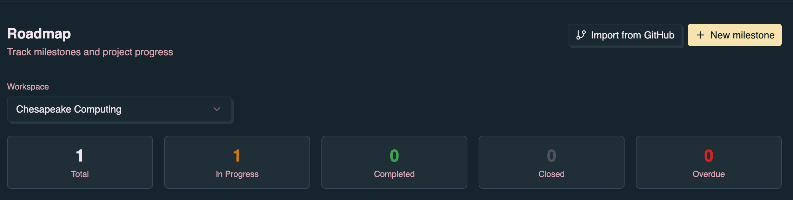
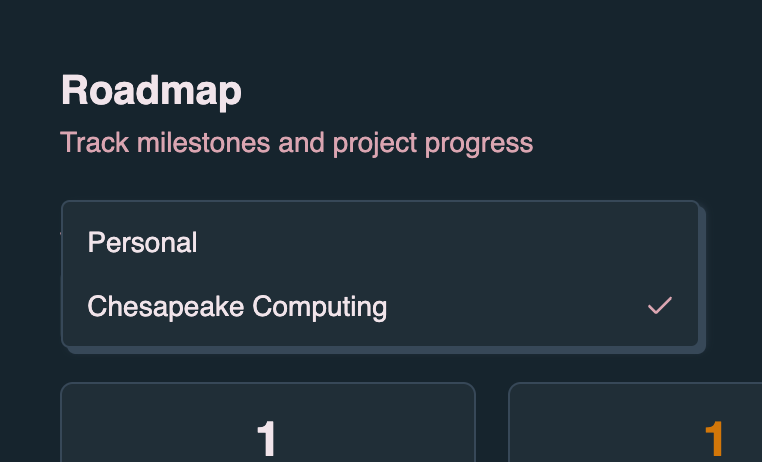
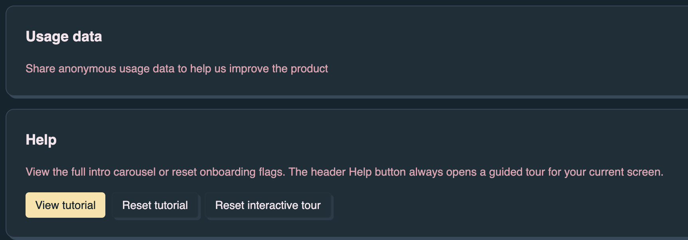

## Overview

Denoise is an offline-first planning app for small tasks, project milestones,
and GitHub-backed work. It keeps personal planning fast and local by default,
then adds sync, collaboration, GitHub issue integration, and dn-powered
automation when you sign in and connect a repository.

The default experience is **Roadmap-first**: open the Roadmap to see milestones,
then open a milestone to manage its tasks. See
[Getting started — App layout](/denoise/getting-started/#app-layout) for routes
and navigation.

[Denoise Pro](/denoise/subscription-and-pro/) adds task kickstart, repository
initialization, and workflow dispatch from the app UI on GitHub-linked
milestones. See [Milestone details](/denoise/milestone-details/) for the full
milestone view workflow.

## Core features

- **Offline-first tasks** — Create and edit tasks locally on the milestone view,
  even without signing in.
- **Roadmap and milestones** — Group tasks into projects; track progress from
  the Roadmap home.
- **Focus timer** — Track focused work sessions from the header **Focus**
  button.
- **Sign-in with GitHub or Google** — Enable cloud sync and identity-backed
  workflows.
- **Collaboration** — Share milestones with collaborators; control task
  visibility with publish/private settings.
- **GitHub issue sync** — Link milestones, import issues, and push task updates
  back to GitHub.
- **Task kickstart (Pro)** — Dispatch agent-backed kickstart from a task in a
  GitHub-linked milestone via **Kickstart!** in the task detail dialog.

## Task management

Tasks live on the **milestone view** (`/milestone/:id`). Open a milestone from
the Roadmap to reach them. Click **Add task** in the milestone header to create
a task with a title, tags, and markdown description.

- **Complete or reopen** — Toggle task completion from the task row.
- **Edit** — Update task title and description in the task detail dialog.
- **Delete** — Remove tasks you no longer need.
- **Tags** — Organize tasks; GitHub-linked tags sync as labels.
- **Due dates** — Track deadlines.
- **Urgent flag** — Mark tasks that need priority attention.

### Filtering and sorting tasks

**Filter tasks by text** — Use the search input in the milestone header to
filter tasks within the current milestone. The filter searches both task titles
and descriptions (case-insensitive).

**Sort tasks** — Use the sort dropdown in the milestone header to change the
order of tasks:

- **Default order** — Tasks are shown in their original order
- **Name A-Z** — Sort tasks alphabetically (ascending)
- **Name Z-A** — Sort tasks alphabetically (descending)
- **Kickstart priority (Pro)** — Order tasks by kickstart plan priority on
  GitHub-linked milestones with repository context

**Kickstart order** — On the milestone view, click the **Kickstart order** chip
in the task filter row to toggle kickstart priority sorting (Pro). Free users
see a locked chip with Pro upgrade details.

**Hide completed tasks** — Click the eye icon in the milestone filter row to
toggle visibility of completed tasks. When enabled, only incomplete tasks are
shown.

## Focus timer

Click **Focus** in the header to start a Pomodoro-style focus session. Choose
the session length in **Profile** → **Display Settings** (25 min, 50 min, or 2
hours).

## Milestones

Milestones help you organize tasks into groups or projects:

1. On the **Roadmap**, click **New milestone**.
2. Enter a name and optional description, then click **Create**.
3. Open the milestone from the roadmap list to add and manage tasks.

Use the **Workspace** selector on the Roadmap to scope milestones by
organization when you belong to multiple workspaces.

### Milestone persistence

Your last opened milestone is saved. When you return to a milestone, denoise
restores that view so you can pick up where you left off.

### Filtering milestones

On the Roadmap, use **status filters** (All, Open, In Progress, Completed,
Closed, Overdue), the **Repository** dropdown, and the **Sort** control to
narrow the milestone list.

## Collaboration

Share a milestone with teammates from the milestone header (**Share**). Shared
milestones sync tasks in real time when you are **Online** and signed in.

Task visibility:

- Tasks in personal milestones default to **private** (visible only to you).
- Tasks in shared milestones are visible to milestone participants.
- Use **Publish** on a private task to make it visible to collaborators.

Collaborators need sign-in and **Online** mode to see shared milestone updates.
See [Authentication](/denoise/authentication/) for sync requirements.

## Workbench

The [Workbench](/denoise/workbench/) is a fast task-list view for **My Tasks**
and for the full app experience when milestones are disabled. It uses an inline
**Add a task...** input rather than the milestone view's **Add task** dialog.

See the dedicated page for layout, filtering, task actions, and how the
workbench relates to the Roadmap when milestones are on or off.

## Usage metrics (opt-in)

Denoise can collect anonymous usage metrics, such as upgrade clicks and
milestone/task counts, to help improve the product. Metrics are opt-in only. In
**Profile**, enable **Share anonymous usage data to help us improve the
product**.

When enabled, counts are stored in the same KV store as the rest of the app and
included in the existing daily B2 backup.
