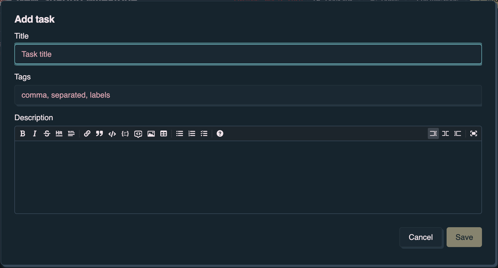
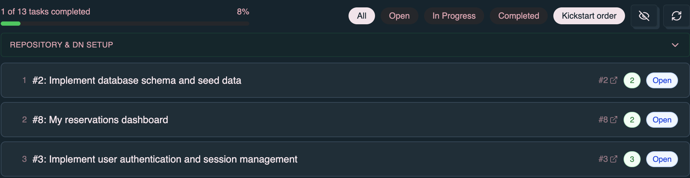
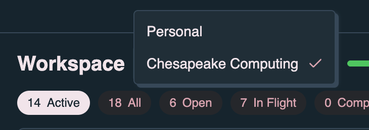
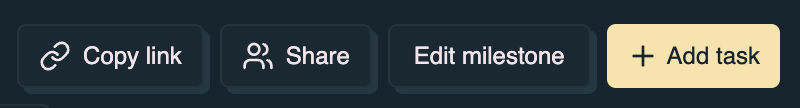
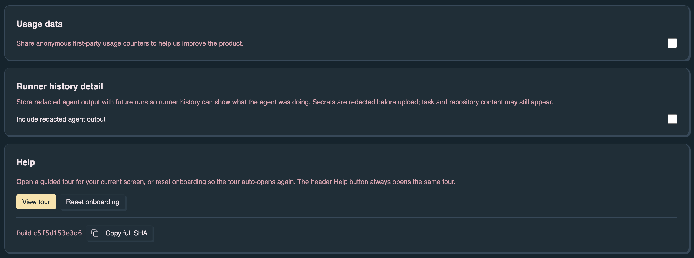

## Overview

Denoise is a planning stack for small software teams. **The Void** covers free
solo tasks that stay on a paired laptop. **denoise** (Denoise Pro) is the
collaborative Roadmap and milestone app with GitHub sync and dn-powered
automation.

In the team app, the default experience is **Roadmap-first**: open the Roadmap
to see milestones, then open a milestone to manage its tasks. A progress bar at
the top shows how many tasks are completed. See
[Getting started](/denoise/getting-started/) for Free vs Pro entry points and
[The Void](/denoise/void/) for the free product.

[Denoise Pro](/denoise/subscription-and-pro/) adds task kickstart, repository
initialization, and workflow dispatch from the app UI on GitHub-linked
milestones. See [Milestone details](/denoise/milestone-details/) for the full
milestone view workflow.

## Core features

- **The Void (Free)** — Solo local tasks via void.denoise.cloud; sync to
  `~/.dn/tasks/` on a paired device runner.
- **Roadmap and milestones (Pro)** — Group tasks into projects; track progress
  from the Roadmap home with cloud sync.
- **Focus timer** — Track focused work sessions from the header **Focus** button
  in denoise.
- **Sign-in with GitHub or Google** — Shared auth across denoise and The Void;
  enable cloud sync and identity-backed workflows in the team app.
- **Collaboration (Pro)** — Share milestones with collaborators; control task
  visibility with publish/private settings.
- **GitHub issue sync (Pro)** — Link milestones, import issues, and push task
  updates back to GitHub.
- **Task kickstart (Pro)** — Dispatch agent-backed kickstart from a task in a
  GitHub-linked milestone via **Kickstart!** in the task detail dialog. On a
  device runner, **Land** then **Sync** finish the same loop as the CLI. See
  [Kickstart, land, sync, and done](/close-out/).

## Task management

Tasks live on the **milestone view** (`/milestone/:id`). Open a milestone from
the Roadmap to reach them. Click **Add task** in the milestone header to create
a task with a title, tags, and markdown description.

- **Complete or reopen** — Toggle task completion from the task row.
- **Edit** — Update task title and description in the task detail dialog.
- **Delete** — Remove tasks you no longer need.
- **Tags** — Organize tasks; GitHub-linked tags sync as labels.
- **Due dates** — Track deadlines.
- **Urgent flag** — Mark tasks that need priority attention.

### Filtering and sorting tasks

**Filter tasks by text** — Use the search input in the milestone header to
filter tasks within the current milestone. The filter searches both task titles
and descriptions (case-insensitive).

**Sort tasks** — Use the sort dropdown in the milestone header to change the
order of tasks:

- **Default order** — Tasks are shown in their original order
- **Name A-Z** — Sort tasks alphabetically (ascending)
- **Name Z-A** — Sort tasks alphabetically (descending)
- **Kickstart priority (Pro)** — Order tasks by kickstart plan priority on
  GitHub-linked milestones with repository context

**Kickstart order** — On the milestone view, click the **Kickstart order** chip
in the task filter row to toggle kickstart priority sorting (Pro). Free users
see a locked chip with Pro upgrade details.

**Hide completed tasks** — Click the eye icon in the milestone filter row to
toggle visibility of completed tasks. When enabled, only incomplete tasks are
shown.

<video autoplay loop muted playsinline class="demo-video" aria-label="Kickstart order — toggle to sort tasks by kickstart plan priority">
  <source src="/demos/kickstart-order.mp4" type="video/mp4" />
</video>

## Focus timer

Click **Focus** in the header to start a Pomodoro-style focus session. Choose
the session length in **Profile** → **Display Settings** (25 min, 50 min, or 2
hours).

## Milestones

Milestones help you organize tasks into groups or projects:

1. On the **Roadmap**, click **New milestone**.
2. Enter a name, choose a **Kickstart publish default** (**Pull request** or
   **Direct to trunk**), and add an optional description and due date. Then
   click **Create**.
3. Open the milestone from the roadmap list to add and manage tasks.

Use the **Workspace** selector on the Roadmap to scope milestones by
organization when you belong to multiple workspaces.

### Milestone persistence

Your last opened milestone is saved. When you return to a milestone, denoise
restores that view so you can pick up where you left off.

### Filtering milestones

On the Roadmap, use the status chips (**Active**, **All**, **Open**, **In
Flight**, **Completed**, **Closed**, **Overdue**) and the **Due date** sort to
narrow the milestone list.

## Collaboration

Share a milestone with teammates from the milestone header (**Share**). Shared
milestones sync tasks in real time when you are **Online** and signed in.

Task visibility:

- Tasks in personal milestones default to **private** (visible only to you).
- Tasks in shared milestones are visible to milestone participants.
- Use **Publish** on a private task to make it visible to collaborators.

Collaborators need sign-in and **Online** mode to see shared milestone updates.
See [Authentication](/denoise/authentication/) for sync requirements.

## The Void

[The Void](/denoise/void/) is the free solo task list. Tasks sync to a paired
laptop under `~/.dn/tasks/` via device runners; denoise does not keep a
long-term cloud todo store for free tasks. There are no milestones in The Void.

See the dedicated page for pairing, Free vs Pro distinctions, and ticketless
kickstart.

## Profile: usage, runner history, and help

On **Profile** (`/profile`), these panels sit together:

- **Usage data** — Enable **Share anonymous first-party usage counters to help
  us improve the product**. Counts include events such as upgrade clicks and
  milestone and task totals. When enabled, they are stored in the same KV store
  as the rest of the app and included in the existing daily B2 backup.
- **Runner history detail** — Enable **Include redacted agent output** to store
  redacted agent output with future runs, so runner history can show what the
  agent was doing. Secrets are redacted before upload. Task and repository
  content may still appear.
- **Help** — **View tour** opens the guided tour for your current screen.
  **Reset onboarding** makes that tour auto-open again on the next load. The
  same card shows the current build and **Copy full SHA**. The header **Help**
  button opens the same tour.

When enabled, counts are stored in the same KV store as the rest of the app and
included in the existing daily B2 backup.

## Related

- [Kickstart, land, sync, and done](/close-out/) — Shared Kickstart, Land, Sync,
  and Done verbs
- [Runners](/denoise/device-runners/) — Pair a device or connect exe.dev
- [Kickstart runtimes](/denoise/kickstart-runtimes/) — Where **Kickstart!** runs
- [Runner logs](/operations/runner-logs/) — Serve stdout for devices and exe.dev
- [dn 0.0.37 and developer device runners](/whats-new/dn-0-0-37/) — Current CLI
  and runner guidance
- [Roadmap](/roadmap/) — Shipped themes and planned work
