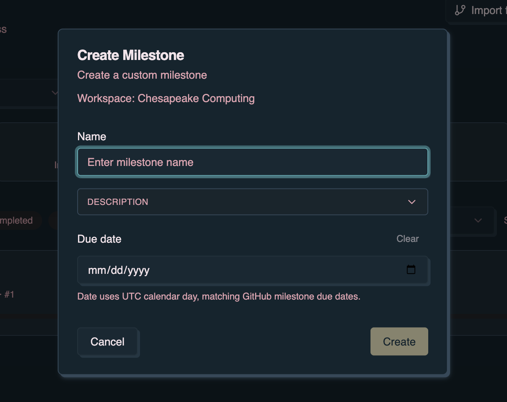
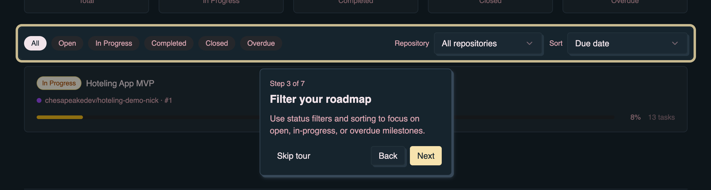

Use this page to sign in, understand the GitHub requirement, and create a first
task in denoise. Start here when you are using the app UI rather than the `dn`
CLI.

## App layout

When **Milestones** is enabled (the default when you are **Online**), denoise
opens to the **Roadmap** — a project-level view of your milestones. Open a
milestone from the roadmap to manage its tasks on the **milestone view**.

| View               | Route            | When                                           |
| ------------------ | ---------------- | ---------------------------------------------- |
| **Roadmap**        | `/`              | Default home when Milestones is enabled        |
| **Milestone view** | `/milestone/:id` | Open a milestone from the roadmap              |
| **Profile**        | `/profile`       | Sign-in, GitHub access, plan, display settings |

_Roadmap — track milestones and project progress from the app home._

The primary workflow is **New milestone** on the Roadmap → open the milestone
card → **Add task** on the milestone view.

To turn milestones off, open **Profile** → **Display Settings** and uncheck
**Milestones**. The app then uses the workbench at `/todo` (a single task list
with an optional sidebar) instead of the Roadmap.

The header shows a sync badge (**Offline**, **Online**, or **Syncing…**). Click
it to enable cloud sync when you are ready. Open **Profile** from the avatar
menu for sign-in and account settings.

## Authentication

The app supports GitHub and Google sign-in:

1. Click **Sign In** in the header.
2. Choose GitHub or Google.
3. Complete the OAuth flow.
4. Return to the app after authentication completes.

After sign-in, the header shows your avatar and an **Online** sync badge when
cloud sync is enabled.

GitHub authentication is required for GitHub milestone and issue integration.
For sign-in behavior, repository access, and how the sync badge interacts with
authentication, see [Authentication](/denoise/authentication/).

## Creating your first task

On the Roadmap:

1. Click **New milestone**.
2. Enter a name and optional description, then click **Create**.

3. Open the milestone from the roadmap list.
4. Click **Add task** in the milestone header.

5. Enter a title, optional tags and description, then click **Save**.

6. Confirm the task appears in the milestone task list.

Use **Take a tour** on the Roadmap or the header **Help** button to open a
guided tour for your current screen.

## Next steps

- Use [Features](/denoise/features/) to learn tasks, milestones, collaboration,
  and GitHub sync.
- Use [GitHub integration](/denoise/github-integration/) when you want to link
  milestones to GitHub issues and dn workflows.
- Use [Milestone details](/denoise/milestone-details/) for DN setup, init_stack,
  and per-task kickstart on GitHub-linked milestones.
- Use [Subscription & Pro](/denoise/subscription-and-pro/) when you want task
  kickstart, repository initialization, and workflow dispatch from the app.
