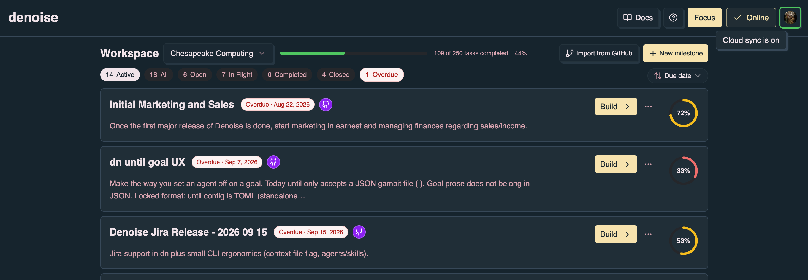
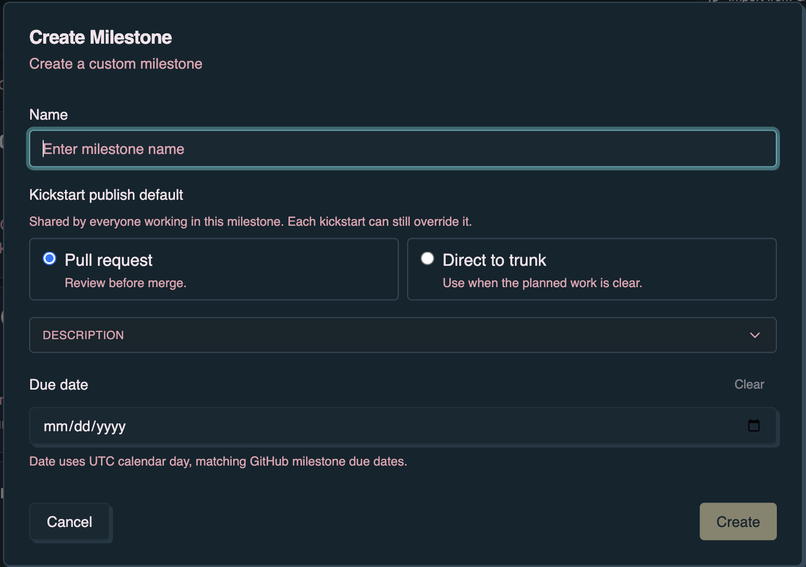
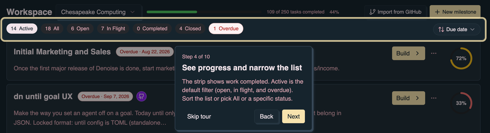

Use this page to choose the right product surface, sign in, and create a first
task. Start here when you are using the app UI rather than the `dn` CLI.

## Choose Free or Pro

| Product             | URL                                              | When to use it                                                                  |
| ------------------- | ------------------------------------------------ | ------------------------------------------------------------------------------- |
| **The Void** (Free) | [void.denoise.cloud](https://void.denoise.cloud) | Solo local tasks that sync to a paired laptop via `dn`. No milestones.          |
| **denoise** (Pro)   | [denoise.cloud](https://denoise.cloud)           | Roadmap, milestones, GitHub sync, shared workspace, and kickstart from the app. |

Signing in at denoise.cloud without Pro lands on `/subscribe`. Choose **Continue
free in The Void** for solo use, or subscribe for the team app. See
[The Void](/denoise/void/) and
[Subscription & Pro](/denoise/subscription-and-pro/).

## App layout (denoise team app)

When you have Denoise Pro (or an org seat), denoise opens to the **Roadmap** — a
project-level view of your milestones. Open a milestone from the roadmap to
manage its tasks on the **milestone view**.

| View               | Route            | When                                      |
| ------------------ | ---------------- | ----------------------------------------- |
| **Roadmap**        | `/`              | Default home for Pro / team use           |
| **Milestone view** | `/milestone/:id` | Open a milestone from the roadmap         |
| **Profile**        | `/profile`       | GitHub access, plan, and display settings |

_Roadmap — track task progress and milestones from the app home._

The primary Pro workflow is **New milestone** on the Roadmap → open the
milestone card → **Add task** on the milestone view.

The header shows a sync badge (**Offline**, **Online**, or **Syncing…**). Click
it to enable cloud sync when you are ready. Open **Profile** from the avatar
menu for account settings.

## Authentication

Sign-in and sign-up happen on
[denoise.cloud/subscribe](https://denoise.cloud/subscribe) (`/subscribe`).

- Existing account: **Sign in** at the top of the page.
- New Pro plan: **Sign in for free trial** or **Sign in to subscribe — $6/mo**.
- Team plan: **Sign in for Team**.
- Free solo use, without a denoise subscription: **Continue in The Void**.

Those sign-in buttons start GitHub OAuth. You return to the app with a session
after GitHub finishes.

After sign-in, the header shows your avatar and an **Online** sync badge when
cloud sync is enabled.

Auth cookies are shared across denoise.cloud and void.denoise.cloud. GitHub
authentication is required for GitHub milestone and issue integration. For
sign-in behavior, repository access, and how the sync badge interacts with
authentication, see [Authentication](/denoise/authentication/).

## Creating your first task

### Free — The Void

1. Open [void.denoise.cloud](https://void.denoise.cloud).
2. Optionally sign in and pair a device runner so tasks land under
   `~/.dn/tasks/` on your laptop.
3. Type a task title and add it.

See [The Void](/denoise/void/) for local sync and ticketless kickstart.

### Pro — denoise Roadmap

On the Roadmap:

1. Click **New milestone**.
2. Enter a name, choose a **Kickstart publish default** (**Pull request** or
   **Direct to trunk**), and add an optional description and due date. Then
   click **Create**.

3. Open the milestone from the roadmap list.
4. Click **Add task** in the milestone header.

5. In **Add work**, choose **Denoise task** or **GitHub issue**. Enter a title
   and description, then create the task or issue.

6. Confirm the task appears in the milestone task list.

Use the header **Help** button to open a guided tour for your current screen. On
the Roadmap, the tour points at the progress strip and the status filters.
**Active** is the default filter (open, in flight, and overdue).

## Next steps

- Use [The Void](/denoise/void/) for free solo tasks and local `dn` sync.
- Use [Features](/denoise/features/) to learn milestones, collaboration, and
  GitHub sync in the team app.
- Use [GitHub integration](/denoise/github-integration/) when you want to link
  milestones to GitHub issues and dn workflows.
- Use [Milestone details](/denoise/milestone-details/) for Runners, stack
  ranking, and per-task kickstart on GitHub-linked milestones.
- Use [Subscription & Pro](/denoise/subscription-and-pro/) for Free vs Pro vs
  Enterprise.
- Use [Runners](/denoise/device-runners/) when you want Void task-sync or Pro
  kickstart on a trusted local checkout.
