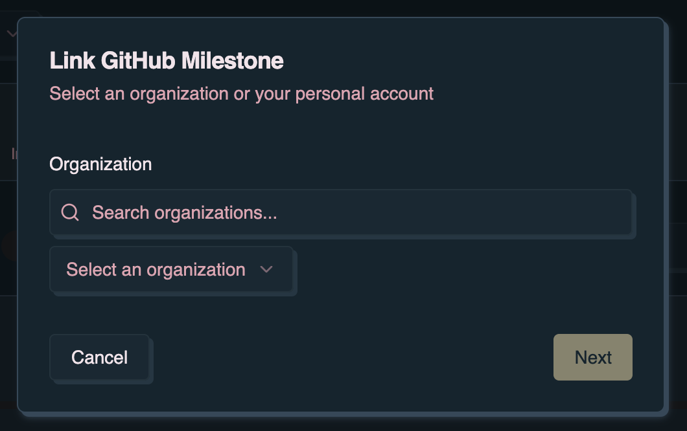
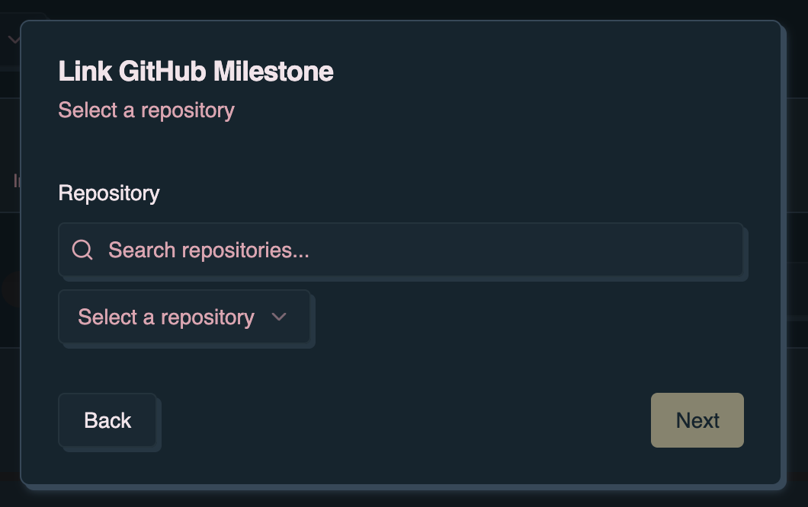
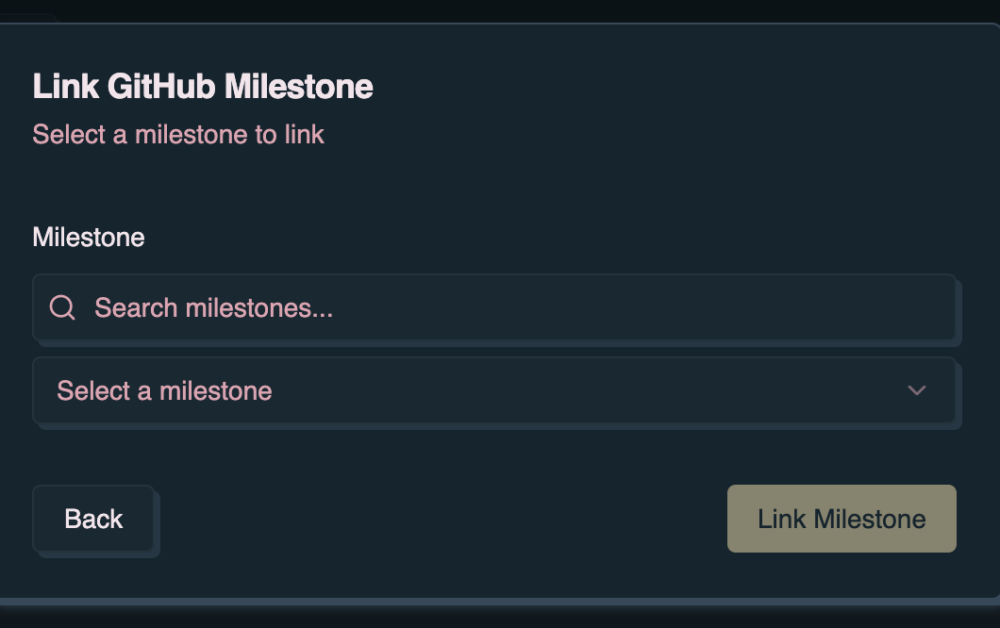
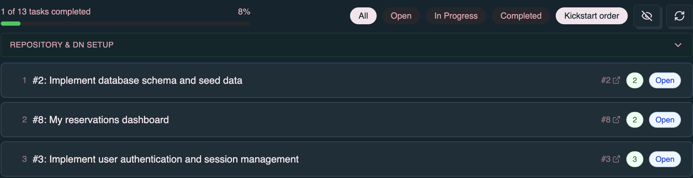
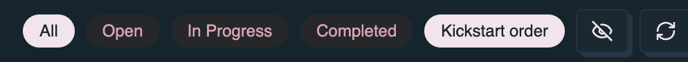

Denoise connects the app experience to GitHub issues, milestones, and installed
`dn` workflows. The app can sync task state with GitHub and, when a repository
has canonical `dn` workflows installed, trigger planning and kickstart
automation from the UI.

Most automation features require [Denoise Pro](/denoise/subscription-and-pro/)
and **Online** mode. GitHub sign-in and repository access are required; see
[Authentication](/denoise/authentication/).

For DN setup, stack initialization, kickstart ordering, and per-task kickstart
on the milestone view, see [Milestone details](/denoise/milestone-details/).

## Prepare the repository

You can set up workflows from the app (see
[Milestone details — Connect dn to this repository](/denoise/milestone-details/#connect-dn-to-this-repository))
or from the terminal:

```bash
dn init workflows --agent opencode
dn workflows validate --json
```

Commit `.github/dn/config.json` and the generated `.github/workflows/dn-*.yml`
files. Set the secret required by the configured agent, such as
`OPENAI_API_KEY`, `ANTHROPIC_API_KEY`, or `CURSOR_API_KEY`. For Cursor, see
[Cursor API key for dn GitHub Actions](/dn-cli/cursor-github-actions/).

When you use the app, **Install/Update workflows** writes the selected agent to
`.github/dn/config.json`. Workflow dispatch uses that repository configuration;
changing the agent picker alone does not update the repo until you re-run
Install workflows.

See [Headless Use — Dispatch payloads](/dn-cli/headless-use/#dispatch-payloads)
for dispatch payloads, permissions, and troubleshooting.

## Linking a milestone to GitHub

To connect a milestone in the app to a GitHub milestone:

1. Create or select a milestone on the **Roadmap**, or use **Import from
   GitHub** on the Roadmap to pull existing GitHub milestones.
2. Edit the milestone and choose to link a GitHub milestone when prompted.
3. Select the organization or user, repository, and open milestone in the GitHub
   Milestone Wizard.
4. Click **Link Milestone** to complete the connection.







Once linked, denoise shows a GitHub indicator on the roadmap card and syncs
issues from GitHub.


## Automatic issue sync

When a milestone is linked to GitHub, the app can:

- Fetch issues from the linked GitHub milestone
- Create app tasks for GitHub issues
- Update tasks when issues change on GitHub
- Reflect closed issues as completed tasks

GitHub issues appear in the app as `#123: Issue Title`. Linked tasks show the
issue title and markdown description in the task card. Sync is disabled while
offline; local changes remain saved and sync again when connectivity returns.



Use the GitHub refresh control on the milestone view to pull the latest issues
for a linked milestone.



## DN automation from the milestone view

On a GitHub-linked milestone, Pro users can:

- Install or update dn workflow templates and configure the agent harness
- Dispatch `dn.init_stack` for milestone stack context
- Sort tasks by kickstart plan priority
- Dispatch `dn.kickstart_issue` per task from the task detail dialog


Denoise dispatches the same workflow events exposed by `dn workflows dispatch`:

- `dn.init_stack` — Generate milestone stack markdown and JSON files.
- `dn.prep_issue_plan` — Produce a plan for an issue (CLI and Actions; not
  exposed as a separate milestone-page button today).
- `dn.kickstart_issue` — Run plan plus implementation with AWP from
  **Kickstart!** in the task detail dialog.

See [Milestone details](/denoise/milestone-details/) for the full UI workflow,
setup states, dispatch feedback, and kickstart blockers.

## Converting tasks to GitHub issues

1. Ensure the task is in a GitHub-linked milestone.
2. Use **Create Issue** on a task that is not already a GitHub issue.
3. Review the title, description, milestone, and labels.
4. Create the issue; denoise links the task and syncs future changes.

## Bidirectional sync

**App to GitHub:** task title, description, tags, and completion state can
update the linked issue.

**GitHub to app:** issue title, body, labels, closed/reopened state, and
milestone changes sync back into denoise.

If sync conflicts occur, the most recent change wins.
