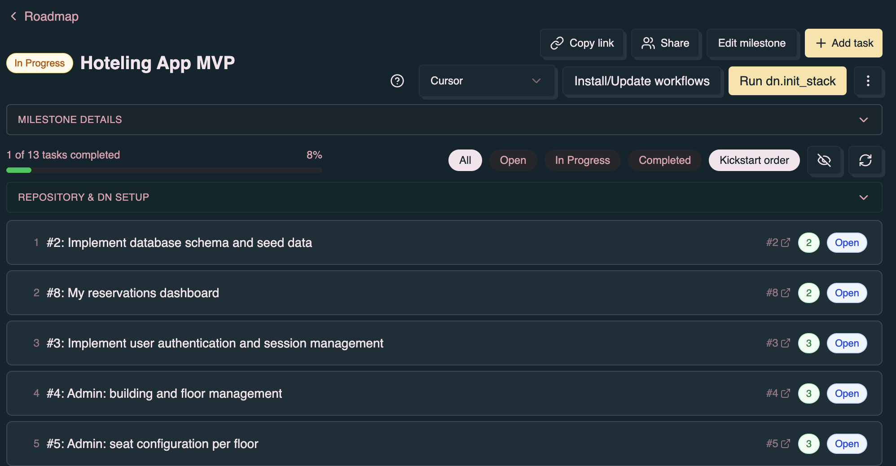
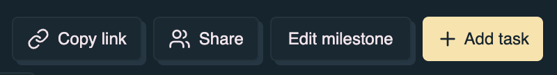
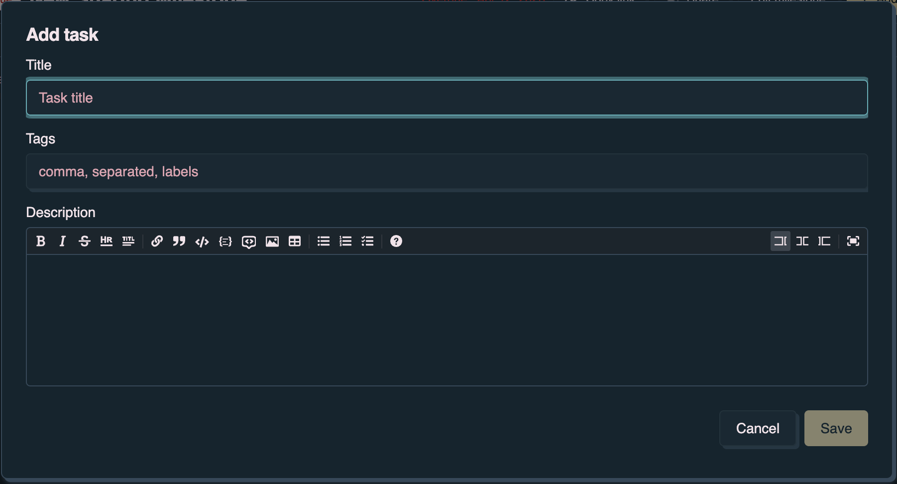
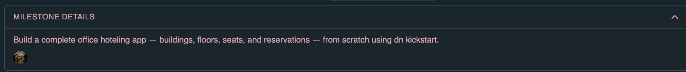
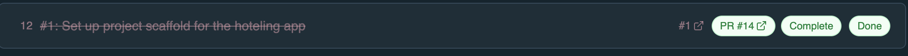

Use this page when you open a milestone in denoise and want to connect dn to the
linked repository, run stack initialization, or kickstart tasks from the UI.

## Prerequisites

Before DN automation is available on a milestone:

- Sign in with **GitHub** (not Google alone). See
  [Authentication](/denoise/authentication/).
- Switch to **Online** mode in the header.
- Link the milestone to a GitHub repository and milestone. See
  [GitHub integration — Linking a milestone](/denoise/github-integration/#linking-a-milestone-to-github).
- Have [Denoise Pro](/denoise/subscription-and-pro/) or an organization Pro
  seat.

You also need write access to the linked repository so denoise can install
workflows and dispatch GitHub Actions events.

## Page layout

Open a milestone from the **Roadmap** to reach the milestone view
(`/milestone/:id`). The page includes:

- **Milestone header** — Copy link, Share, Edit milestone, Add task, and (for
  linked milestones) a GitHub refresh control.
- **DN setup action row** — Agent picker, Install/Update workflows, Run
  dn.init_stack, and an overflow menu (Open Actions, Configure secrets). Visible
  for Pro users on GitHub-linked milestones.
- **Setup status strip** — Short setup summary, dispatch feedback, and stack
  staleness hints when attention is needed.
- **Repository & dn setup** — Collapsible panel with detected repository
  context, template status, setup blockers, and suggested kickstart targets.
- **Task list** — Filter chips (All, Open, In Progress, Completed), optional
  **Kickstart order** toggle, stack staleness pill, and kickstart badges on task
  rows.
- **Task detail dialog** — Opens when you click a task; includes **Kickstart!**
  and dispatch status indicators.

The guided product tour on this page highlights the DN setup action row and
**Repository & dn setup** panel when the milestone is linked to GitHub.

### Milestone header actions

### DN setup action row

### Repository & dn setup panel

## Connect dn to this repository

The DN setup action row and **Repository & dn setup** panel walk through
repository preparation. Complete these steps in order:

1. **Pick an agent** — Choose the agent harness written to
   `.github/dn/config.json` when you install workflows:

   | Agent       | Actions secret required |
   | ----------- | ----------------------- |
   | OpenCode    | None                    |
   | Cursor      | `CURSOR_API_KEY`        |
   | Claude Code | `ANTHROPIC_API_KEY`     |
   | Codex       | `OPENAI_API_KEY`        |

   For Cursor-specific setup, see [Use dn with Cursor](/cookbooks/cursor/).

2. **Install/Update workflows** — Installs or refreshes
   `.github/workflows/dn-*.yml` templates, `.github/dn/config.json`, and the
   agent install script. Requires **Online** mode.

3. **Configure secrets** — Add the secret for your chosen agent. Use **Configure
   secrets** in the overflow menu (⋮) next to the setup actions, or open
   repository Actions secrets in GitHub directly.

4. **Run dn.init_stack** — Optional but recommended. Dispatches stack
   initialization for the linked GitHub milestone so kickstart ordering and meld
   suggestions improve. See [Run dn.init_stack](#run-dninit_stack) below.

### Setup states

Denoise tracks repository readiness as setup progresses:

| State                           | What it means                                                        |
| ------------------------------- | -------------------------------------------------------------------- |
| Not configured                  | Workflows or agent config are missing. Follow the setup steps above. |
| Partially configured            | Some templates or secrets are still missing or outdated.             |
| Ready for dn kickstart and meld | Workflows, agent config, and required secrets are in place.          |

The setup status strip shows a short summary (for example **Setup: Checking…**
while loading, or blocker text when setup is incomplete).

If you change the agent picker after workflows are already installed, denoise
warns that the repository is configured for a different agent. Re-run
**Install/Update workflows** to apply the newly selected agent.

You can also prepare a repository from the terminal instead of the app. See
[GitHub integration — Prepare the repository](/denoise/github-integration/#prepare-the-repository).

## Run dn.init_stack

**Run dn.init_stack** dispatches the `dn.init_stack` workflow for the linked
GitHub milestone number. The workflow scans the repository and writes milestone
stack context (for example `{milestone}.stack.md` in the repo).

Requirements:

- **Online** mode
- No remaining setup blockers (workflows installed, agent config present,
  required secret configured)
- Pro subscription

When you click **Run dn.init_stack**:

1. The setup status strip shows dispatch progress (for example **Dispatching
   dn.init_stack…**).
2. Denoise polls GitHub Actions until the workflow is accepted or fails.
3. A success toast offers **Watch on GitHub** to open the Actions run.

<video autoplay loop muted playsinline class="demo-video" aria-label="Run dn.init_stack — dispatch progress and Watch on GitHub">
  <source src="/demos/dn-init-stack.mp4" type="video/mp4" />
</video>

After a successful run, denoise loads stack scores for the milestone. You may
see kickstart complexity badges, **Kickstart order** sorting, and suggested
kickstart targets in **Repository & dn setup**.

For payload details and CLI parity, see
[Headless Use — Dispatch payloads](/dn/headless-use/#dispatch-payloads).

## Stack order staleness

Stack context can become outdated when issues change after the last
`dn.init_stack` run. Denoise detects this and shows:

- A **Stack order needs refresh** pill in the task filter row
- An amber **Run dn.init_stack** button when staleness is detected
- A banner in **Repository & dn setup** listing issue numbers missing from the
  current stack

Re-run **Run dn.init_stack** to refresh stack order for the milestone.

Denoise may also detect kickstart-plan staleness when some open issues have plan
metadata and others do not. Re-running init_stack or refreshing from GitHub can
align plan data with the current issue set.

## Kickstart order and task badges

After stack initialization (or when kickstart plan metadata is present from
sync), Pro users can sort tasks by kickstart plan priority:

- Click the **Kickstart order** chip in the task filter row to toggle between
  manual order and kickstart priority order.
- You can also choose **Kickstart priority (Pro)** from the sort dropdown in the
  milestone header.

<video autoplay loop muted playsinline class="demo-video" aria-label="Kickstart order — toggle to sort tasks by kickstart plan priority">
  <source src="/demos/kickstart-order.mp4" type="video/mp4" />
</video>

Task rows may show:

- A **numeric complexity badge** from the kickstart plan
- A **disqualified** indicator with a reason when kickstart cannot run on that
  issue
- **Kickstart status chips** after dispatch — Running, Failed, or Complete — and
  a **PR** link when a pull request is available

Free users see a locked **Kickstart order** chip that explains the Pro
requirement.

## Kickstart a task

Per-task kickstart plans and implements the issue. Choose an available runtime
in the confirmation dialog: GitHub Actions, Cursor Cloud, a managed cloud VM,
local managed execution, or a paired developer device. Availability depends on
repository setup and the account. A device job never falls back silently to
hosted compute.

1. Open a task in a GitHub-linked milestone (click the task row).
2. In the task detail dialog, click **Kickstart!**
3. Confirm **Run kickstart for this task?** in the dialog.
4. Follow queued, running, failed, and completed states in the dialog or task
   status chips. GitHub Actions runs also provide **Watch on GitHub**. Completed
   published runs show a PR link when one was reported.

<video autoplay loop muted playsinline class="demo-video" aria-label="Kickstart a task — confirm dispatch, track progress, and open the pull request">
  <source src="/demos/kickstart-task.mp4" type="video/mp4" />
</video>

**Kickstart!** is available when:

- You have Pro (or an organization Pro seat).
- The task is in a GitHub-linked milestone with a linked issue.
- Repository setup is complete (**Ready for dn kickstart and meld.**).
- The issue is open and not disqualified during stack planning.
- You are the task owner or a collaborator on a shared task. Private tasks
  restrict kickstart to the owner and collaborators.

When kickstart is disabled, the dialog shows a short reason (for example
incomplete repository setup, disqualified issue, or closed task).

For CLI-oriented planning and implementation depth, see
[Completing GitHub Issues](/dn/completing-github-issues/).

## Next steps

- [GitHub integration](/denoise/github-integration/) — Link milestones, sync
  issues, convert tasks to GitHub issues
- [Tips & troubleshooting](/denoise/tips-troubleshooting/) — When DN setup or
  kickstart actions are disabled
- [Subscription & Pro](/denoise/subscription-and-pro/) — Pro requirements for
  automation from the app
