Use this page when you open a milestone in denoise and want to connect dn to the
linked repository, run stack initialization, or kickstart tasks from the UI.

## Prerequisites

Before DN automation is available on a milestone:

- Sign in with **GitHub** (not Google alone). See
  [Authentication](/denoise/authentication/).
- Switch to **Online** mode in the header.
- Link the milestone to a GitHub repository and milestone. See
  [GitHub integration — Linking a milestone](/denoise/github-integration/#linking-a-milestone-to-github).
- Have [Denoise Pro](/denoise/subscription-and-pro/) or an organization Pro
  seat.

You also need write access to the linked repository so denoise can install
workflows and dispatch GitHub Actions events.

## Page layout

Open a milestone from the **Roadmap** to reach the milestone view
(`/milestone/:id`). The page includes:

- **Header** — Status pill and title, then **Add task**, **Import issues**, copy
  GitHub link, **Runners**, and an overflow menu.
- **Milestone details** — Collapsed by default. Open it for the description and
  a preferred-runner prompt.
- **Task list** — Progress bar, filter chips (**All**, **Open**, **Completed**),
  **Kickstart order**, hide-completed, GitHub refresh, and one row per task.

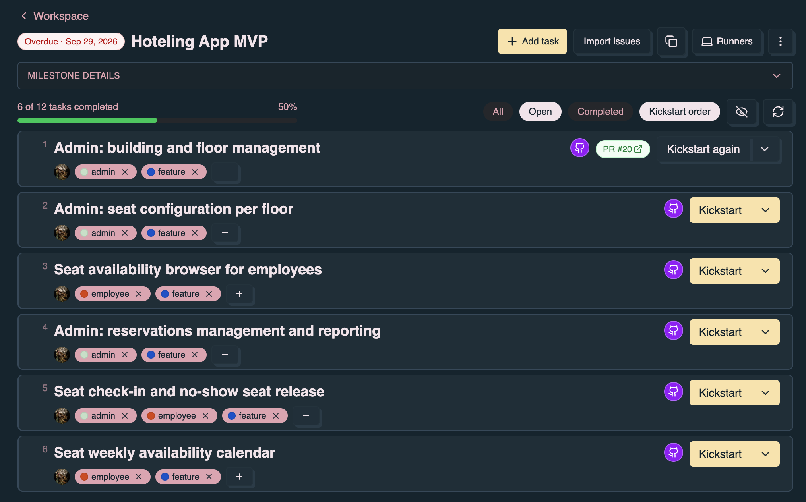

Use the header **Help** button to open a guided tour for this screen.

### Header actions

**Add task**, **Import issues**, the copy-link button, and **Runners** sit in
the header. The overflow menu holds **Copy link**, **Share**, **Edit
milestone**, **Daily workflows**, and **Refresh stack…** (or **Initialize
stack…** when the milestone has no stack yet).

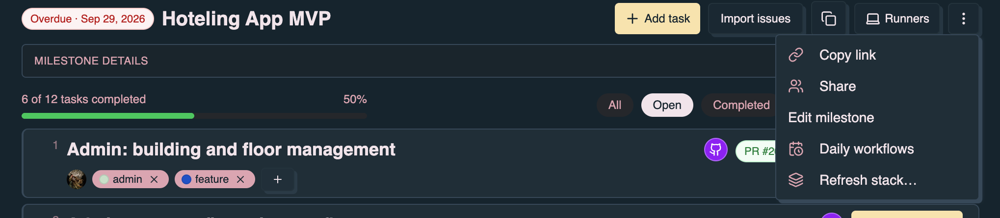

**Import issues** pulls open GitHub issues into this milestone. Issues already
on the milestone are marked **Already imported**.

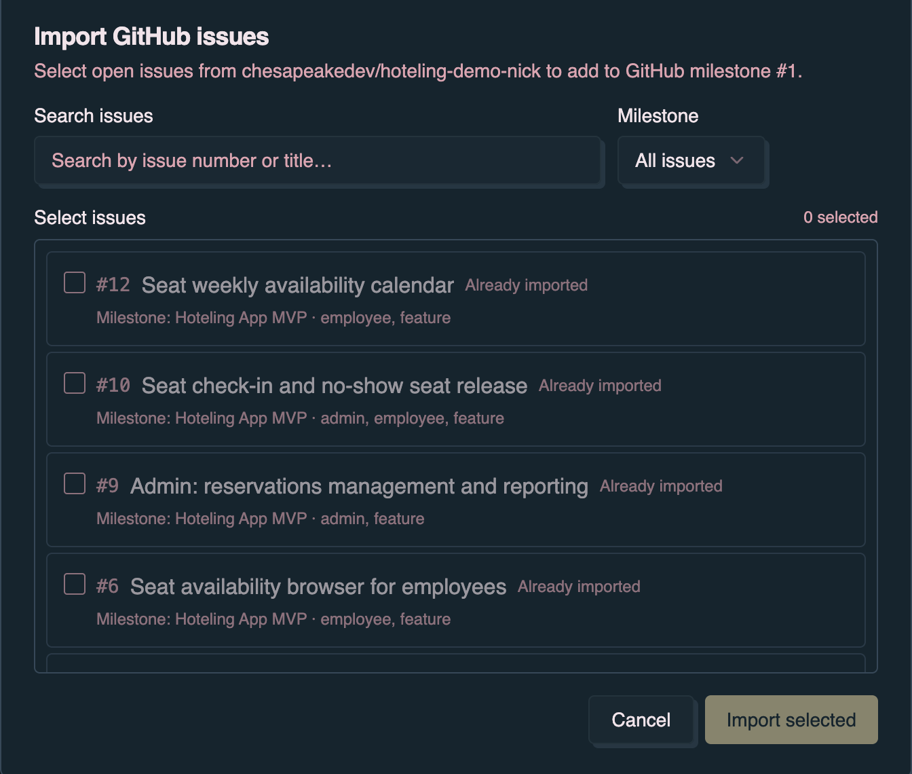

**Share** opens **Manage Participants**. Search by name, email, or GitHub
username.

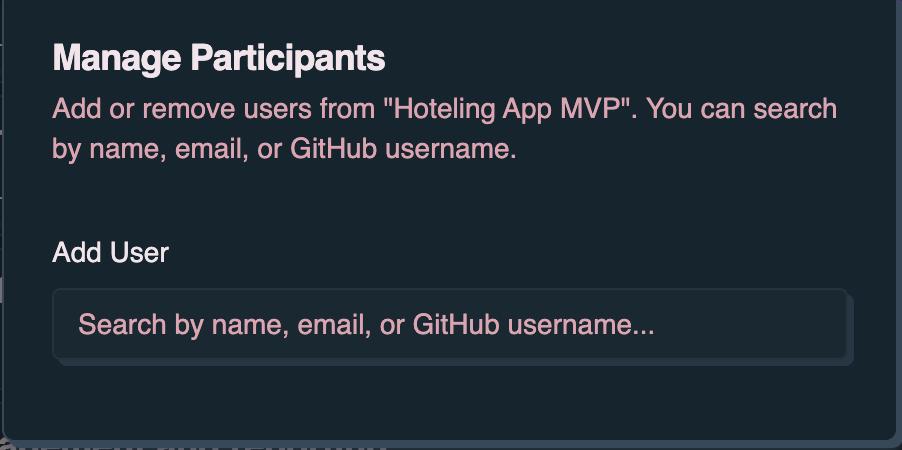

**Edit milestone** changes the title, **Kickstart publish default** (**Pull
request** or **Direct to trunk**), description, and due date.

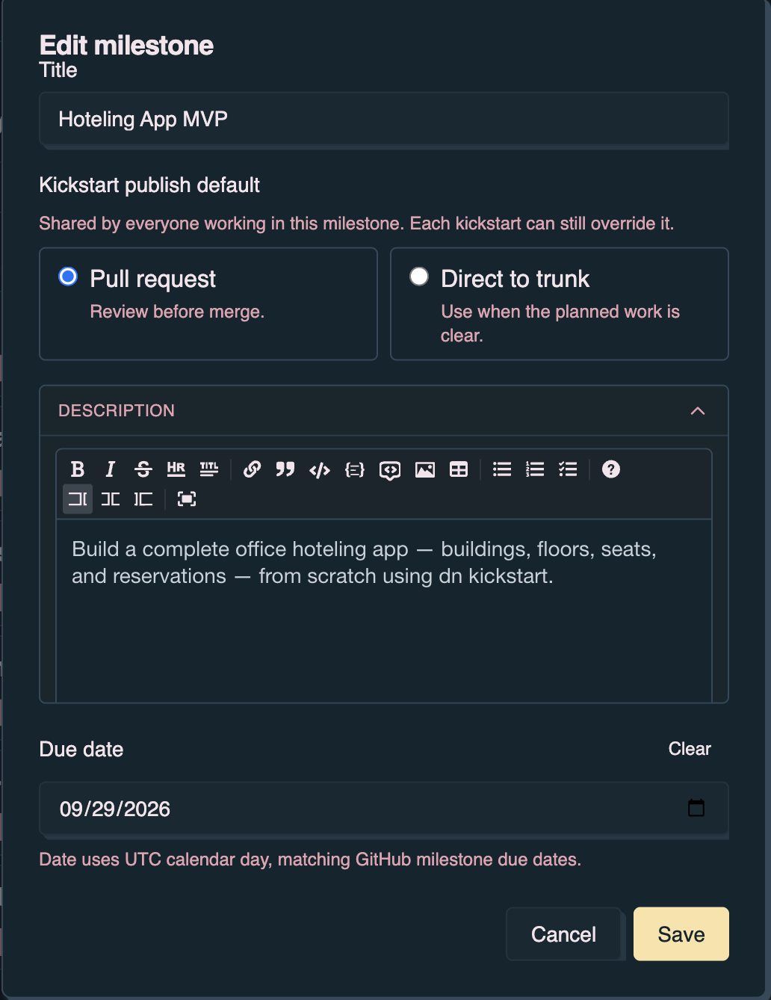

**Daily workflows** installs, enables, or runs **Daily kickstart**
(`dn.daily_kickstart`) for this milestone.

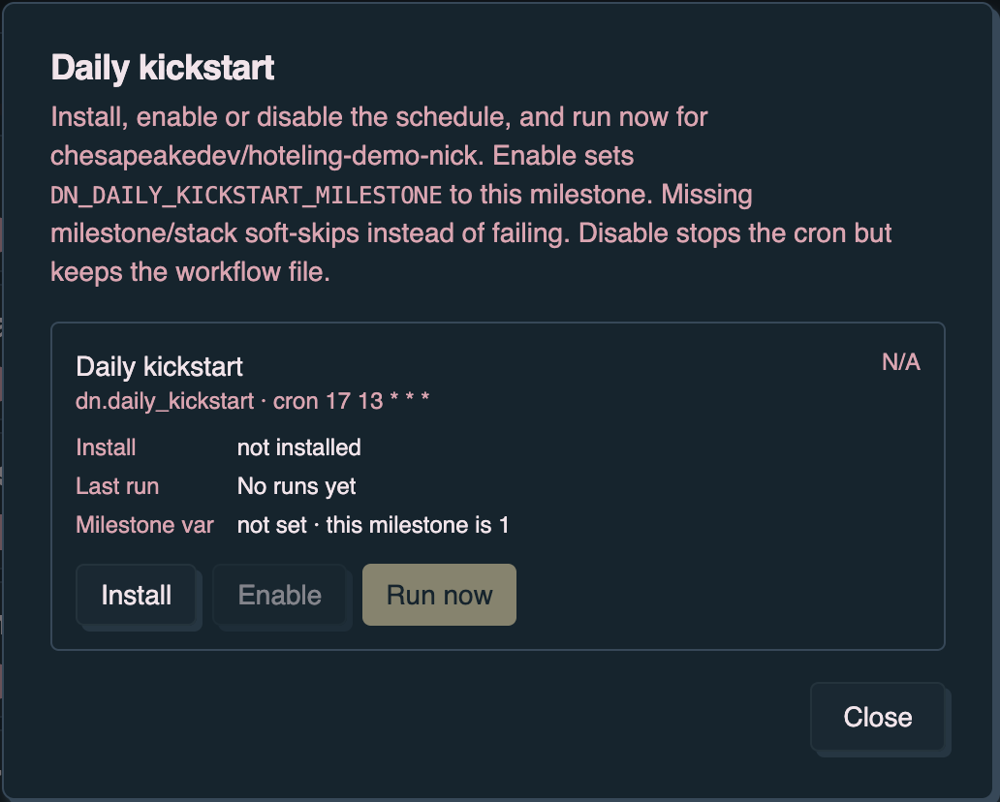

### Filters

The strip under the header shows tasks completed and a progress bar. Filter with
**All**, **Open**, and **Completed**. **Kickstart order** sorts by stack
priority (Pro). The eye icon hides completed tasks. The refresh icon pulls the
latest GitHub issues.

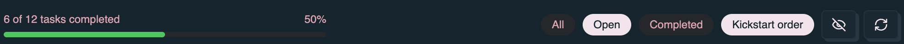

### Milestone details

Expand **Milestone details** for the description and the preferred-runner line.
Until a runner is preferred, the row says quick kickstart opens kickstart setup,
with **Choose runner**.

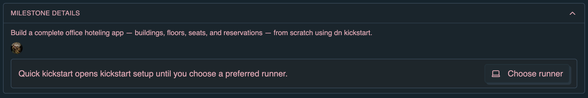

### Add task

**Add task** opens **Add work**. Choose **Denoise task** (kept in this
workspace) or **GitHub issue** (created in the linked milestone).

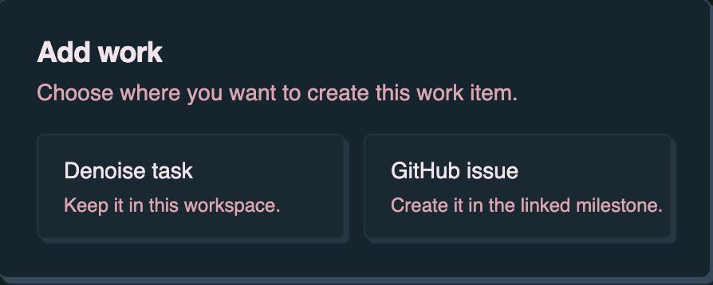

A Denoise task takes a title, labels, and a markdown description.

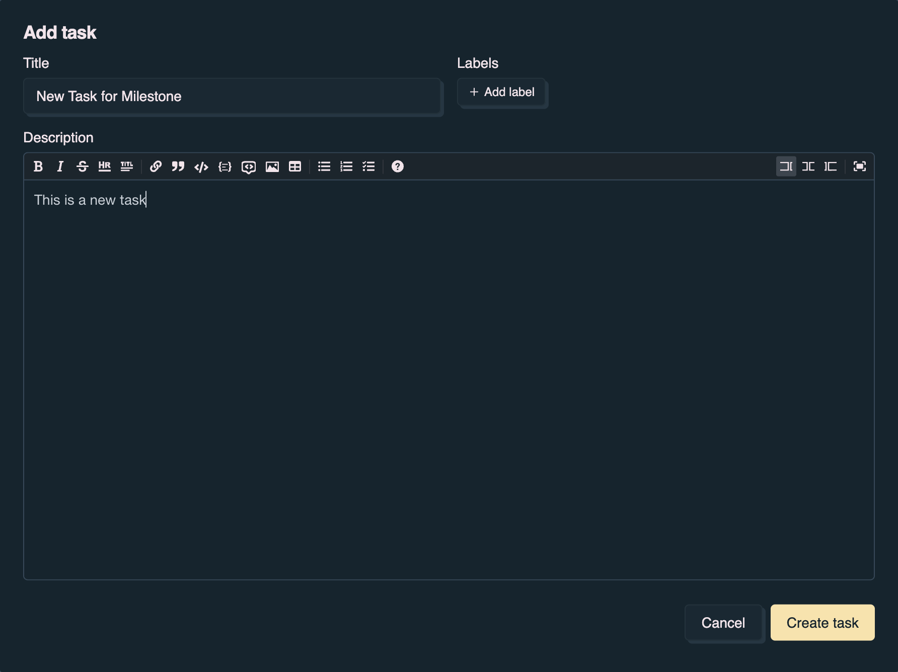

A GitHub issue takes a title, description, assignees, and labels. The linked
repository and milestone are shown on the form.

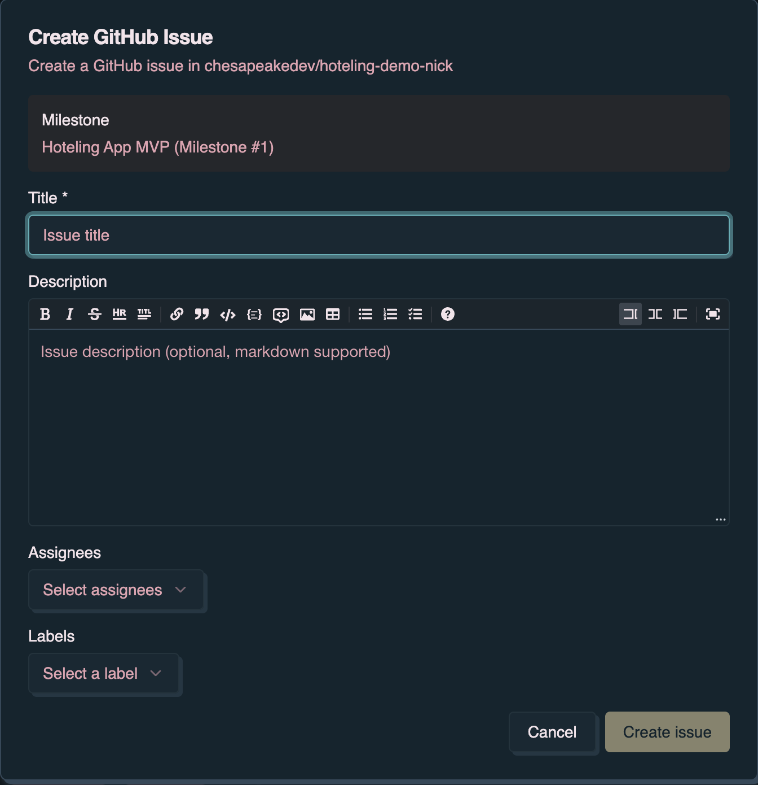

On a task row, **+** opens the label picker.

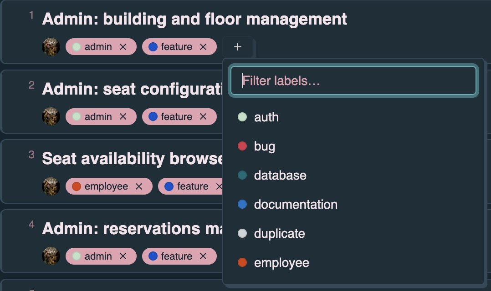

## Connect dn to this repository

Open **Runners** on a GitHub-linked Pro milestone. The dialog asks where
kickstart should run: a paired device, **exe.dev**, or **GitHub Actions**. Each
option has an **Implement in** checkout. See
[Runners](/runners/device-runners/).

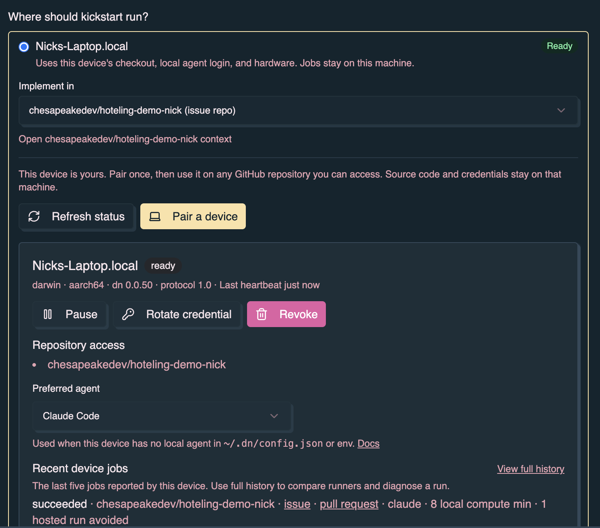

GitHub Actions setup is on that card, not a separate button row:

1. **Pick an agent.** The choice is written to `.github/dn/config.json` when you
   install workflows.

   | Agent       | Actions secret required |
   | ----------- | ----------------------- |
   | OpenCode    | None                    |
   | Cursor      | `CURSOR_API_KEY`        |
   | Claude Code | `ANTHROPIC_API_KEY`     |
   | Codex       | `OPENAI_API_KEY`        |

   For Cursor-specific setup, see [Use dn with Cursor](/cookbooks/cursor/).

2. **Install workflows.** Installs or refreshes the `dn` workflow files. The
   card lists `dn.init_stack`, `dn.meld_issue_plan`, and `dn.kickstart_issue` as
   installed or not installed. Requires **Online** mode.
3. **Configure secrets** or **Open Actions** on the same card when the agent
   needs a repository secret.

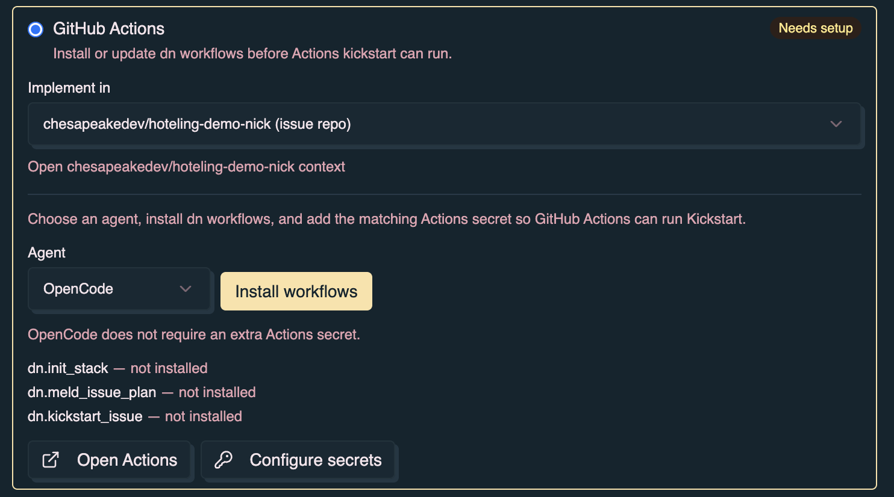

A runner shows **Ready**, **Needs setup**, or **Offline**. If you change the
agent after workflows are installed, install workflows again so the repository
matches the new agent.

exe.dev connects with `EXE_TOKEN` and a harness image. Kickstart stays blocked
until Denoise can read the repository's `opencode.json` when that harness needs
a model.

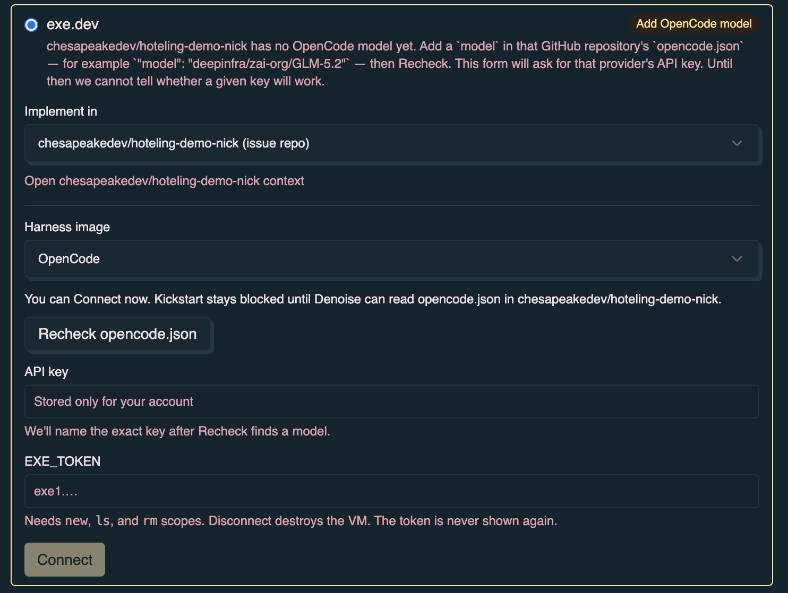

You can also prepare a repository from the terminal. See
[GitHub integration — Prepare the repository](/denoise/github-integration/#prepare-the-repository).

## Initialize or refresh the stack

**Initialize stack** (or **Refresh stack** after a stack exists) ranks milestone
issues for **Kickstart order**. It opens a stack PR in the repository when
publish completes. Choose a device, exe.dev, or GitHub Actions. If that runner
is not ready, the confirm button is **Set up runner** and **Runners** jumps to
setup.

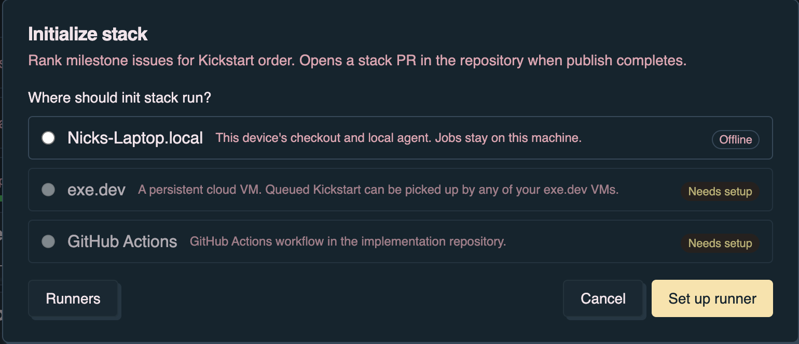

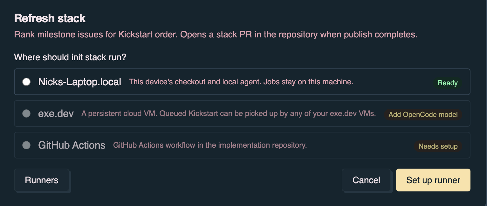

Requirements:

- **Online** mode
- A runner that can run `dn.init_stack` (device ready, or GitHub Actions
  workflows installed)
- Pro subscription

<video autoplay loop muted playsinline class="demo-video" aria-label="Run dn.init_stack — dispatch progress and Watch on GitHub">
  <source src="/demos/dn-init-stack.mp4" type="video/mp4" />
</video>

After a successful run, denoise loads stack scores for the milestone and
**Kickstart order** can sort the task list.

For payload details and CLI parity, see
[Headless Use — Dispatch payloads](/runners/headless-use/#dispatch-payloads).

## Stack order staleness

Stack context can become outdated when issues change after the last init-stack
run. Open the overflow menu and choose **Refresh stack…** to rank the issues
again.

Denoise may also detect kickstart-plan staleness when some open issues have plan
metadata and others do not. Refreshing the stack or refreshing from GitHub can
align plan data with the current issue set.

## Kickstart order and task badges

After stack initialization (or when kickstart plan metadata is present from
sync), Pro users can sort tasks by kickstart plan priority. Click the
**Kickstart order** chip in the filter row to toggle between manual order and
kickstart priority order.

<video autoplay loop muted playsinline class="demo-video" aria-label="Kickstart order — toggle to sort tasks by kickstart plan priority">
  <source src="/demos/kickstart-order.mp4" type="video/mp4" />
</video>

Task rows show **Kickstart** when the issue is ready. While a run is in progress
the row shows a status line and **Cancel**.

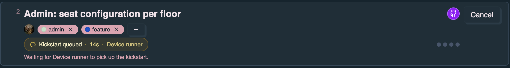

When the plan is ready, the row offers **Review plan**.

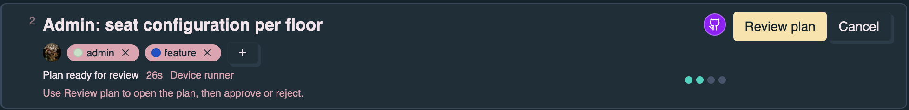

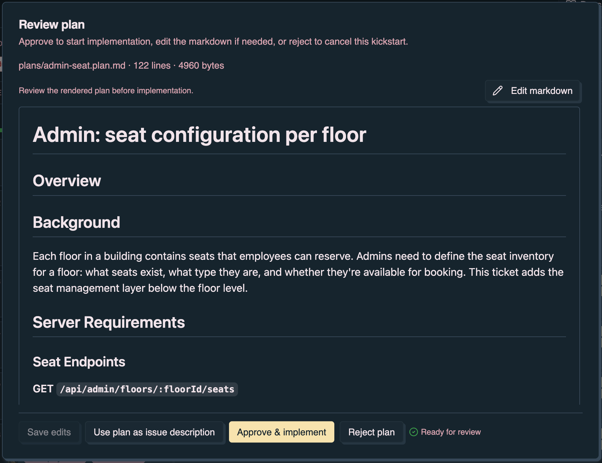

Approving the plan moves the row to implementation.

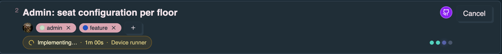

A published run shows the GitHub mark, a **PR** link, and **Kickstart again**.

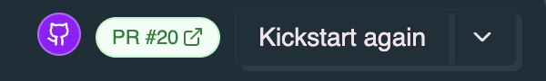

Free users see a locked **Kickstart order** chip that explains the Pro
requirement.

## Kickstart a task

**Kickstart** on a task row opens a setup page, not a confirm dialog. The page
starts from the issue summary, then asks where kickstart should run and how
detailed the plan should be.

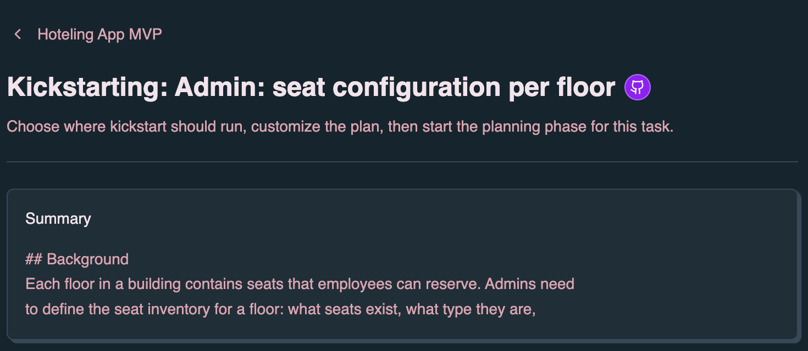

Choose a paired device, **exe.dev**, or **GitHub Actions**, and an **Implement
in** checkout. A device job stays on that machine. Docker sandbox is CLI-only on
hosted denoise. See [Kickstart runtimes](/runners/kickstart-runtimes/).

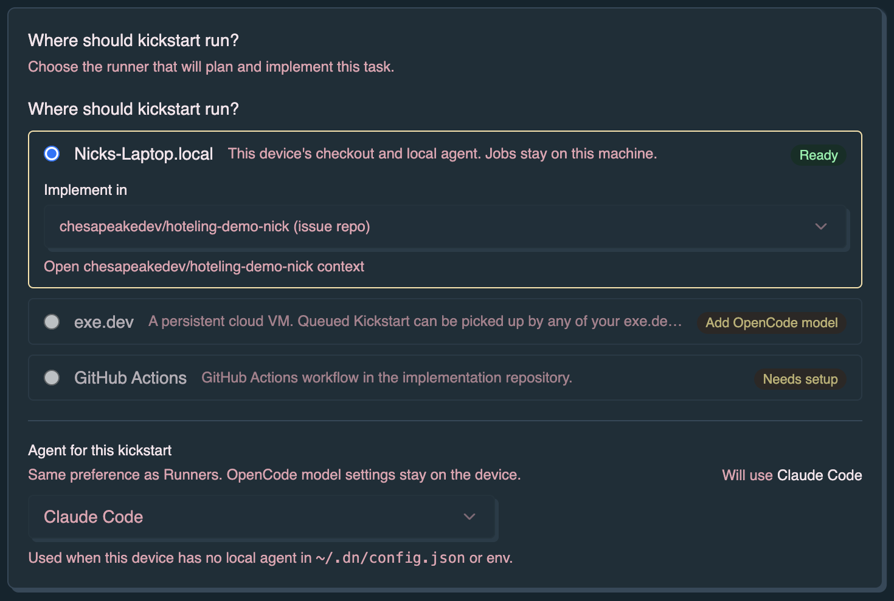

**Plan detail** defaults to **Balanced**. Optional additional guidance steers
the planning agent without replacing the issue text.

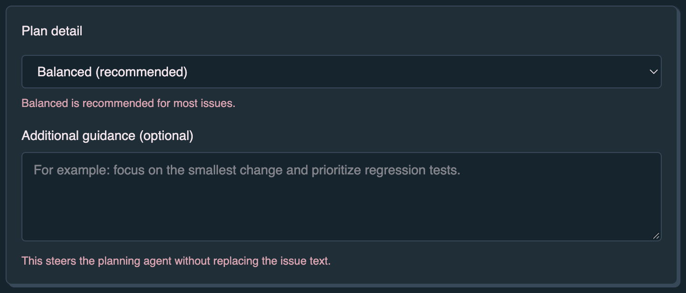

**After kickstart** chooses what happens when implementation finishes:

- **Review locally before publishing** — Keep changes on the device, then land
  and sync.
- **Open a pull request** — Commit, push a branch, and open a GitHub pull
  request.
- **Commit directly to trunk** — Lint, test, commit, and push to the default
  branch.

**Advanced** sets phase time limits. The default is plan 10 minutes and
implement 20 minutes.

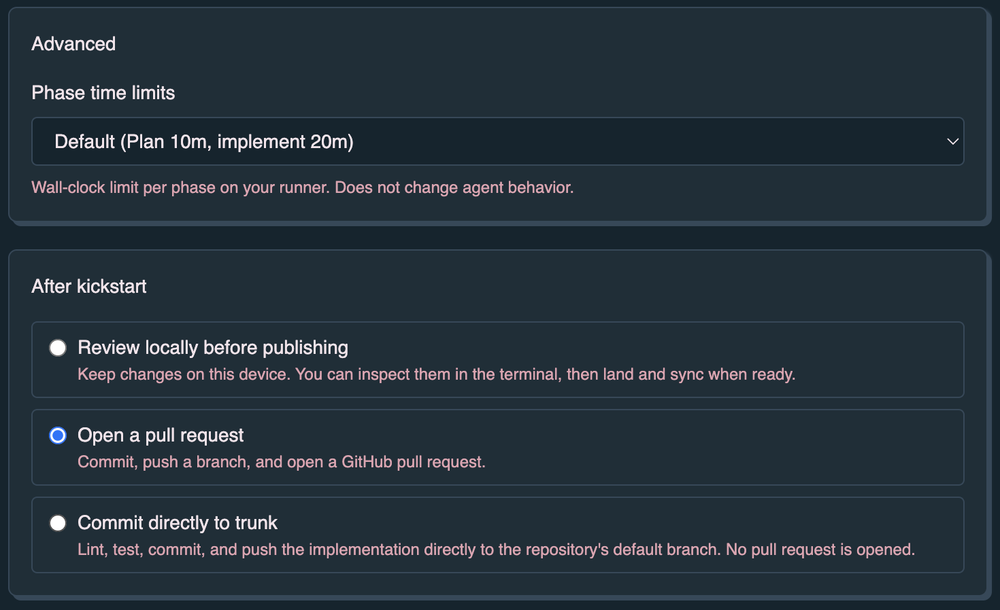

The progress strip on the task row shows queued, planning, and implementing
states. GitHub Actions runs can offer **Watch on GitHub**. See
[Kickstart runtimes — Configure progress](/runners/kickstart-runtimes/#configure-progress-for-runners).

On a **leave-local** device run, Kickstart ends at Lint (`dn ensure lint`). Then
**Land** commits on the device, **Sync** re-runs lint, runs tests, and publishes
to trunk, and **Done** closes the GitHub issue. See
[Kickstart, land, sync, and done](/close-out/). On the pull-request path, host
CI is the gate.

<video autoplay loop muted playsinline class="demo-video" aria-label="Kickstart a task from the milestone view through plan review and a pull request">
  <source src="/demos/kickstart-task.mp4" type="video/mp4" />
</video>

**Kickstart** is available when:

- You have Pro (or an organization Pro seat).
- The task is in a GitHub-linked milestone with a linked issue.
- A runner for that task is **Ready**.
- The issue is open and not disqualified during stack planning.
- You are the task owner or a collaborator on a shared task. Private tasks
  restrict kickstart to the owner and collaborators.

When kickstart is disabled, the row or setup page shows a short reason (for
example a runner that needs setup, a disqualified issue, or a closed task).

For CLI-oriented planning and implementation depth, see
[Completing GitHub Issues](/dn/completing-github-issues/).

## Next steps

- [Kickstart, land, sync, and done](/close-out/) — Shared Kickstart, Land, Sync,
  and Done verbs
- [Kickstart runtimes](/runners/kickstart-runtimes/) — Where kickstart runs and
  how progress fidelity works
- [Runners](/runners/device-runners/) — Pair a device to your account and choose
  an execution checkout
- [GitHub integration](/denoise/github-integration/) — Link milestones, sync
  issues, convert tasks to GitHub issues
- [Tips & troubleshooting](/denoise/tips-troubleshooting/) — When runners or
  kickstart actions are disabled
- [Subscription & Pro](/denoise/subscription-and-pro/) — Pro requirements for
  automation from the app
- [dn 0.0.37 and developer device runners](/whats-new/dn-0-0-37/) — CLI release history
  and runner guidance
