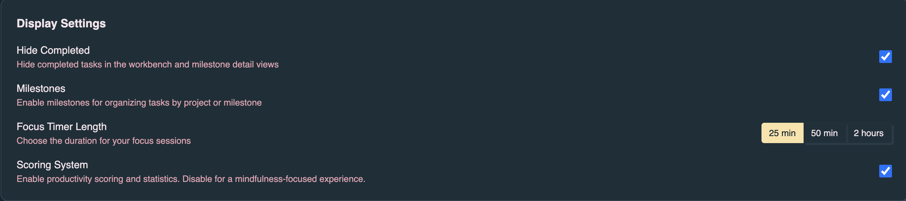
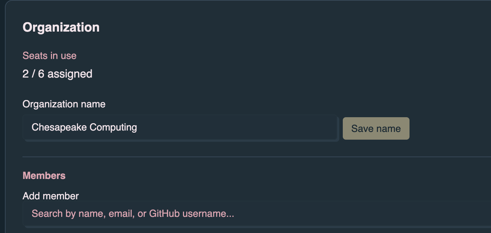

Denoise is free for core planning: offline-first tasks, milestones, focus timer,
and basic cloud sync. **Denoise Pro** unlocks agent-backed automation from the
app UI — task kickstart, repository initialization, and dn workflow dispatch on
GitHub-linked milestones.

## What Pro includes

Pro turns denoise into a command center for shipping work:

- **Task kickstart** — Dispatch `dn.kickstart_issue` from a task with
  **Kickstart!** in the task detail dialog; follow progress and pull requests
  from the milestone view. Depending on setup, execution can use GitHub Actions,
  Cursor Cloud, a managed VM, managed local execution, or a paired developer
  device.
- **Richer collaboration** — Shared context around milestones and tasks so
  everyone sees the same picture.
- **Automation and integrations** — Included in your subscription as new
  productivity features ship (for example DN setup actions on the milestone view
  and per-task kickstart dispatch).
- **Priority consideration** — Feedback and early access to new productivity
  features.

Pro is required for GitHub-backed automation from the app: installing workflow
templates, running `dn.init_stack`, kickstart ordering, and **Kickstart!** on
tasks. See [Milestone details](/denoise/milestone-details/) for setup steps.

## Manage your plan

1. Sign in with GitHub or Google.
2. Open **Profile** from the avatar menu.
3. Under **Plan & billing**, view your current plan or upgrade.

After Stripe Checkout, the app polls until billing status updates (webhooks can
lag briefly). A success toast confirms when Pro is active.

## Organization and Enterprise

If your account belongs to an organization with managed seats, Pro access may
come from an assigned seat rather than a personal subscription. Organization
admins see an **Organization** section in Profile to manage members and seat
assignments.

For repository automation prerequisites (workflows, secrets, milestone linking),
see [GitHub integration](/denoise/github-integration/) and
[Authentication](/denoise/authentication/).

## Related pages

- [Features](/denoise/features/) — Tasks, milestones, collaboration
- [Milestone details](/denoise/milestone-details/) — DN setup, init_stack,
  kickstart order, and per-task kickstart
- [GitHub integration](/denoise/github-integration/) — Link milestones and sync
  issues
- [Tips & troubleshooting](/denoise/tips-troubleshooting/) — When Pro-gated
  actions are disabled
