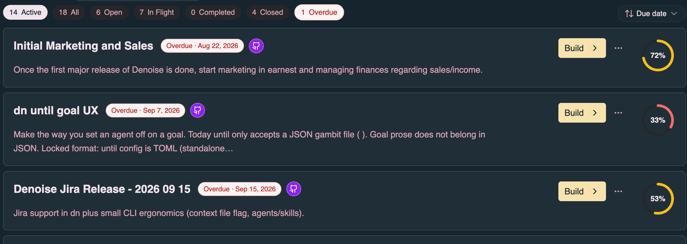
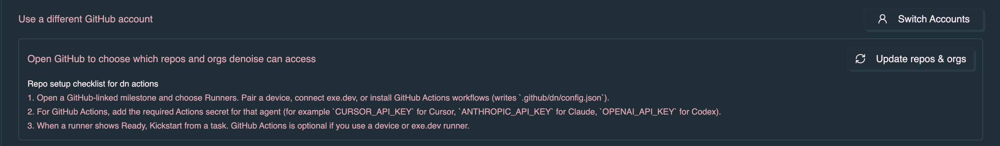

Use this page when denoise is connected to GitHub but sync, issue creation, or
milestone linking does not behave as expected. The tips keep app data, GitHub
issues, and collaborator visibility predictable.

## Tips and best practices

### GitHub integration

1. **Link milestones early** — Link your milestone to GitHub before adding many
   tasks, so you can convert them to issues as you go.
2. **Use tags for GitHub labels** — Tags in the app become GitHub labels.
3. **Keep descriptions detailed** — When converting tasks to issues, add
   detailed descriptions (they become the GitHub issue body).
4. **Monitor sync status** — The header sync badge shows when you are **Online**
   and syncing with GitHub.

   

5. **GitHub-linked tasks** — You can't move GitHub-linked tasks to different
   milestones; the issue number prefix is managed automatically.
6. **Initialize the repo before kickstart** — In **Runners**, install workflows
   and configure secrets. Then **Initialize stack** from the overflow menu
   before you click **Kickstart** on a task. See
   [Milestone details](/denoise/milestone-details/). Choose where the run
   executes in [Kickstart runtimes](/denoise/kickstart-runtimes/).
7. **Expect coarse progress without a public base URL** — If live phase/step
   updates are missing for GitHub Actions, the denoise deploy may lack
   `KICKSTART_PROGRESS_BASE_URL`. See
   [Progress reporting](/dn/progress-reporting/).

### General

1. Use milestones for projects to group related tasks on the Roadmap.
2. Use tags to categorize tasks across milestones.
3. Set due dates to track deadlines.
4. Mark urgent tasks for high-priority items.
5. Use **Publish** to make tasks visible to collaborators (default is private).

## Troubleshooting

### "Create Issue" button doesn't appear

- Ensure the task is in a milestone
- Ensure the milestone is linked to GitHub (look for the GitHub indicator on the
  roadmap card)

  

- Ensure the task isn't already a GitHub issue

### Runners or kickstart actions are disabled

- **Not signed in with GitHub** — GitHub integration requires GitHub auth, not
  Google alone. See [Authentication](/denoise/authentication/).
- **Offline mode** — Switch to **Online** via the header sync badge. Workflow
  install and kickstart dispatch require a server connection.
- **Milestone not linked to GitHub** — Link the milestone to a GitHub repository
  and milestone first. See
  [GitHub integration — Linking a milestone](/denoise/github-integration/#linking-a-milestone-to-github).
- **Runner not ready** — Open **Runners**. On GitHub Actions, pick an agent,
  **Install workflows**, and add the Actions secret. A device shows **Offline**
  or **Needs setup** until it is paired. See
  [Milestone details — Connect dn to this repository](/denoise/milestone-details/#connect-dn-to-this-repository).

  

  

- **Agent picker out of date** — If you changed the agent after installing
  workflows, choose **Install workflows** again so `.github/dn/config.json`
  matches your selection.
- **Stack order needs refresh** — Open issues were added or changed after the
  last init-stack run. Open the overflow menu and choose **Refresh stack…**.
- **Pro required** — Workflow install, stack ranking, kickstart ordering, and
  **Kickstart** require
  [Denoise Pro](/denoise/subscription-and-pro/) (or an organization Pro seat).
- **Issue disqualified** — Stack planning marked the issue ineligible for
  kickstart. Check the reason on the task row or kickstart setup page.
- **Closed issue** — Kickstart is only available for open GitHub issues.
- **Private task** — **Kickstart** on a private task is limited to the owner
  and milestone collaborators.
- **Missing repository access** — In **Profile**, use **Update repos & orgs** to
  grant denoise access to the linked repository.

  

### Changes aren't syncing to GitHub

- Check your internet connection
- Verify you're authenticated with GitHub
- Check the browser console for errors
- Ensure you have write permissions to the GitHub repository

### GitHub issues aren't appearing in the app

- Wait a few minutes for automatic sync
- Use the refresh control on the milestone view
- Verify the milestone is correctly linked to GitHub
- Check that you have read access to the repository

### Can't link a milestone to GitHub

- Ensure you're authenticated with GitHub (not just Google)
- Verify you have access to the repository and milestone
- Check that the milestone exists on GitHub
- Use **Update repos & orgs** in Profile if the repository is not listed

### Device runner pairing or kickstart

- Pair and approve from a GitHub-linked milestone (**Runners**) or from
  **Devices** in The Void, then run `dn runner doctor` on the device.
- Register each trusted checkout with `dn runner register` before selecting it
  as the **Execution checkout**. Denoise does not clone missing checkouts and
  does not store local paths.
- Device jobs never fall back silently to GitHub Actions or managed VMs.
- GitHub Actions stays on the planning repository. A device runner can execute
  in a different registered checkout when you have GitHub write access there.
- Use `dn` **0.0.37** or newer for the device-runner protocol. See
  [Runners](/denoise/device-runners/) and
  [dn 0.0.37 and developer device runners](/whats-new/dn-0-0-37/).
- exe.dev uses the same Kickstart job queue as a paired device. **Offline**
  means no heartbeat for 90 seconds; jobs still queue for 24 hours. If you
  deleted the pet at exe.dev, Create VM. Serve and production log locations:
  [Runner logs](/operations/runner-logs/).
