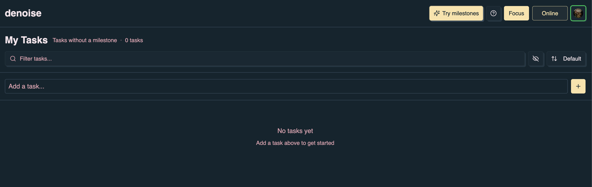
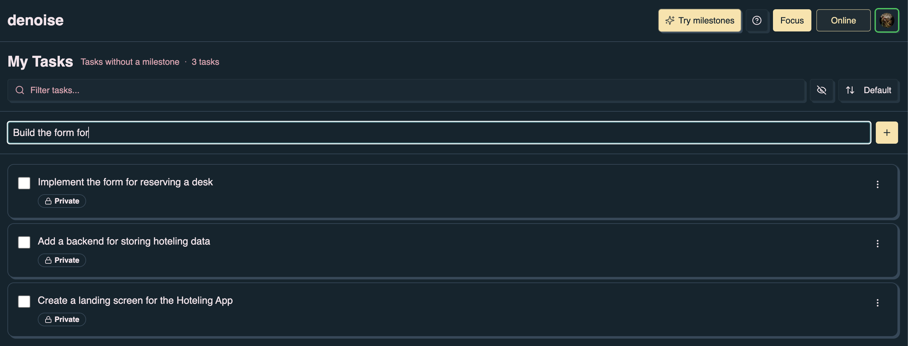
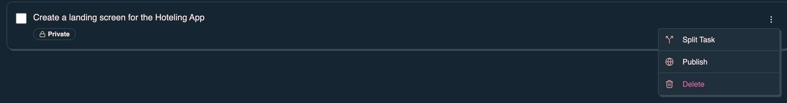

The **workbench** is denoise's inline task list. It is optimized for fast
capture: type a task, press **Enter**, and keep going. Use it for personal todos
that are not tied to a milestone, or as the full app experience when milestones
are disabled.

The Roadmap and milestone view are the default when **Milestones** is enabled.
See [Getting started — App layout](/denoise/getting-started/#app-layout) for how
the views fit together.

## When you see the workbench

| Situation                   | Route          | What you see                                                          |
| --------------------------- | -------------- | --------------------------------------------------------------------- |
| **Milestones off**          | `/` or `/todo` | Workbench only — **My Tasks**, no sidebar                             |
| **Milestones on, My Tasks** | `/todo`        | Workbench for tasks without a milestone; milestone sidebar may appear |
| **Direct navigation**       | `/plan`        | Same workbench UI as `/todo`                                          |

When milestones are disabled, the app home (`/`) renders the workbench instead
of the Roadmap. Uncheck **Milestones** in **Profile** → **Display Settings**, or
click **Try milestones** in the header to switch between modes.

With milestones off, the header shows **Try milestones** — one click re-enables
the Roadmap home.

## Page layout

The workbench has three main areas:

- **Header row** — Title (**My Tasks** or the selected milestone name), task
  count, filter field, hide-completed control, and sort dropdown.
- **Task input** — **Add a task...** field with a **+** button.
- **Task list** — Rows with checkbox, title, visibility badge, and a **⋮**
  actions menu.

When no milestone is selected, the title reads **My Tasks** and the subtitle
shows **Tasks without a milestone** with a count.

## Adding tasks

1. Click the **Add a task...** input.
2. Type the task title.
3. Press **Enter** or click **+**.

New tasks are **private** by default. They are stored locally in IndexedDB and
sync to the cloud when you are signed in and **Online**.

Tasks added on the workbench without a milestone stay in **My Tasks**. When
milestones are enabled, use **Move to Milestone** in the task menu to assign
them to a project (see [Task actions](#task-actions) below).

## Filtering and sorting

Use the same controls as on the milestone view header:

- **Filter tasks...** — Search task titles and descriptions (case-insensitive).
- **Hide completed** — Eye icon to toggle visibility of completed tasks.
- **Sort** — **Default order**, **Name A-Z**, or **Name Z-A**.

Hide-completed preference is shared with the milestone view and is set in
**Profile** → **Display Settings**.

## Task actions

Open the **⋮** menu on a task row for secondary actions.

Common actions on **My Tasks**:

| Action         | What it does                                           |
| -------------- | ------------------------------------------------------ |
| **Split Task** | Break one task into smaller follow-up items            |
| **Publish**    | Make a private task visible to milestone collaborators |
| **Delete**     | Remove the task                                        |

When milestones are enabled, the menu can also include **Move to Milestone**. On
GitHub-linked milestones, you may see **Create GitHub Issue**, **View on
GitHub**, and related entries. See
[GitHub integration](/denoise/github-integration/) for linked-task behavior.

To edit title, description, tags, due dates, and urgency, click the task row to
open the task detail dialog (same as on the milestone view).

## Workbench with milestones enabled

If **Milestones** is on and you open `/todo`, the workbench shows **My Tasks**
while a **milestone sidebar** can list projects. Selecting a milestone in the
sidebar switches the workbench to that milestone's task list; selecting **My
Tasks** returns to unassigned todos.

For full milestone planning, GitHub sync, and dn automation, use the **Roadmap**
and [milestone view](/denoise/milestone-details/) instead of the workbench
alone.

## Switching back to the Roadmap

- Click **Try milestones** in the header (when milestones are off), or
- Ensure **Milestones** is checked in **Profile** → **Display Settings**, then
  open `/` or use navigation to return to the Roadmap.

## Related pages

- [Getting started](/denoise/getting-started/) — Sign-in and roadmap-first first
  task flow
- [Features](/denoise/features/) — Focus timer, collaboration, and shared task
  behavior
- [Milestone details](/denoise/milestone-details/) — DN setup and kickstart on
  GitHub-linked milestones
