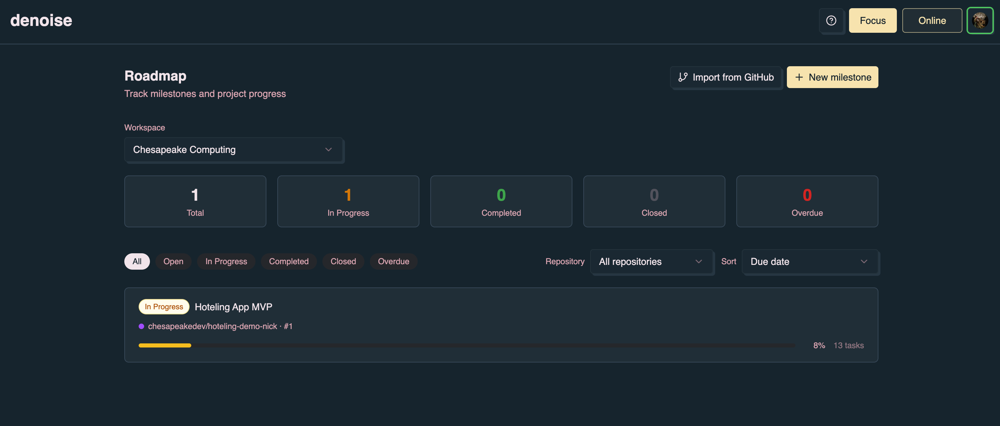

Welcome to the denoise documentation! This website contains exhaustive
documenation on all denoise software & how to integrate into your workflow.
Denoise is a set of tools for managing agentic workflows to create software
factorires. The goal of the toolkit is to enable you as a developer to share a
streamlined workflow with your agent(s) and teammates in async & real-time
experiences, working one level above syntax.

Denoise is isomorophic. A terminal & web experience share the same core
capabilities — "ticket" workflows, agent-backed planning, automation of SWE,
SRE, and product minutiae, and integration with existing git repositories.
**dn** is the CLI for developers who work from the terminal & agent harnesses
such as Cursor & Claude Code. **denoise** is the web app for product managers,
designers, and other stakeholders who prefer a visual, collaborative experience
for building.

Everyone builds. Cross-functional teams stay aligned on project planning and
available automations without forcing everyone into the same tool:

- **dn** - The CLI for GitHub issue workflows, agent-backed planning and
  implementation, repository agent context, and automation dispatch.
- **dn skill** - First-class integration with the most popular harnesses, such
  as Claude Code, Cursor, Codex, and opencode
- **denoise** - A collaborative planning app that gives users the ability to
  orchestrate agent automation alongside developers working from the terminal

## Quick links

| Need                                         | Start here                                                                                                                                                                                          |
| -------------------------------------------- | --------------------------------------------------------------------------------------------------------------------------------------------------------------------------------------------------- |
| Install and use dn                           | [Installation](/dn-cli/installation/)                                                                                                                                                               |
| Implement GitHub issues with dn and an agent | [Completing GitHub Issues](/dn-cli/completing-github-issues/)                                                                                                                                       |
| Automate in GitHub Actions                   | [Headless Use](/dn-cli/headless-use/) -> [OpenCode](/dn-cli/opencode/), [Claude](/dn-cli/claude/), [Codex](/dn-cli/codex/), or [Cursor](/dn-cli/cursor-github-actions/)                             |
| Connect denoise to dn Workflows              | [Milestone details](/denoise/milestone-details/) -> [GitHub integration](/denoise/github-integration/) -> [Headless Use — Denoise integrators](/dn-cli/headless-use/#denoise-and-other-integrators) |
| Denoise Pro and task kickstart               | [Subscription & Pro](/denoise/subscription-and-pro/) -> [Milestone details](/denoise/milestone-details/)                                                                                            |

## Examples

This documentation leans towards being a reference manual. For examples of using
dn, look in our [open source repositories](https://github.com/chesapeakedev/).
